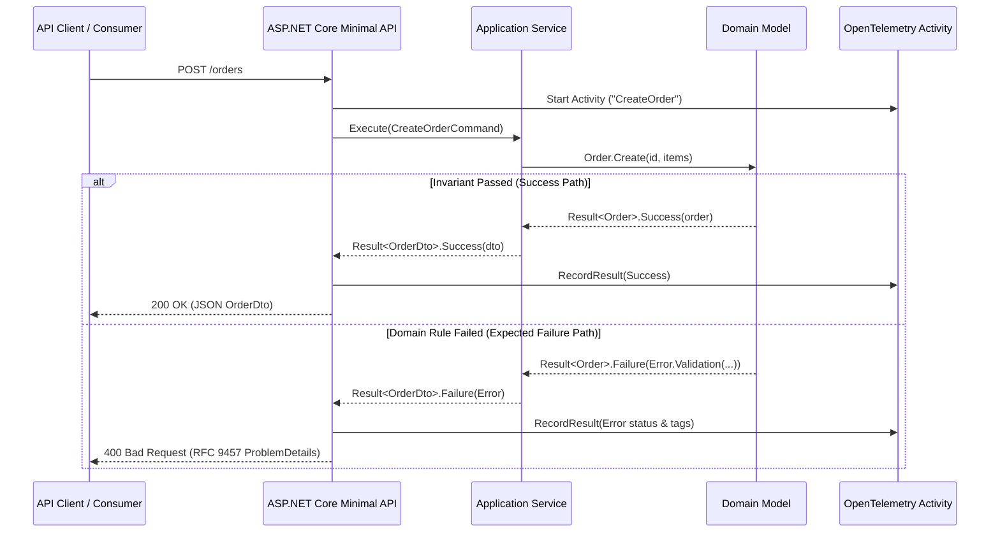
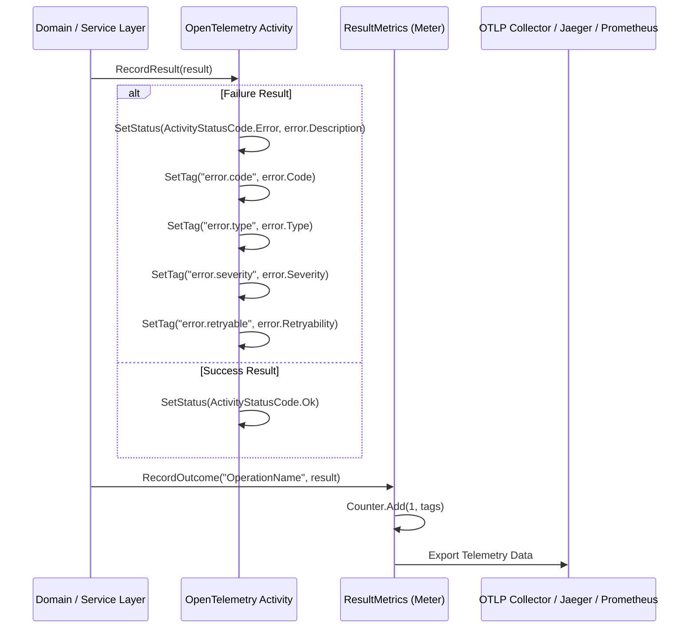
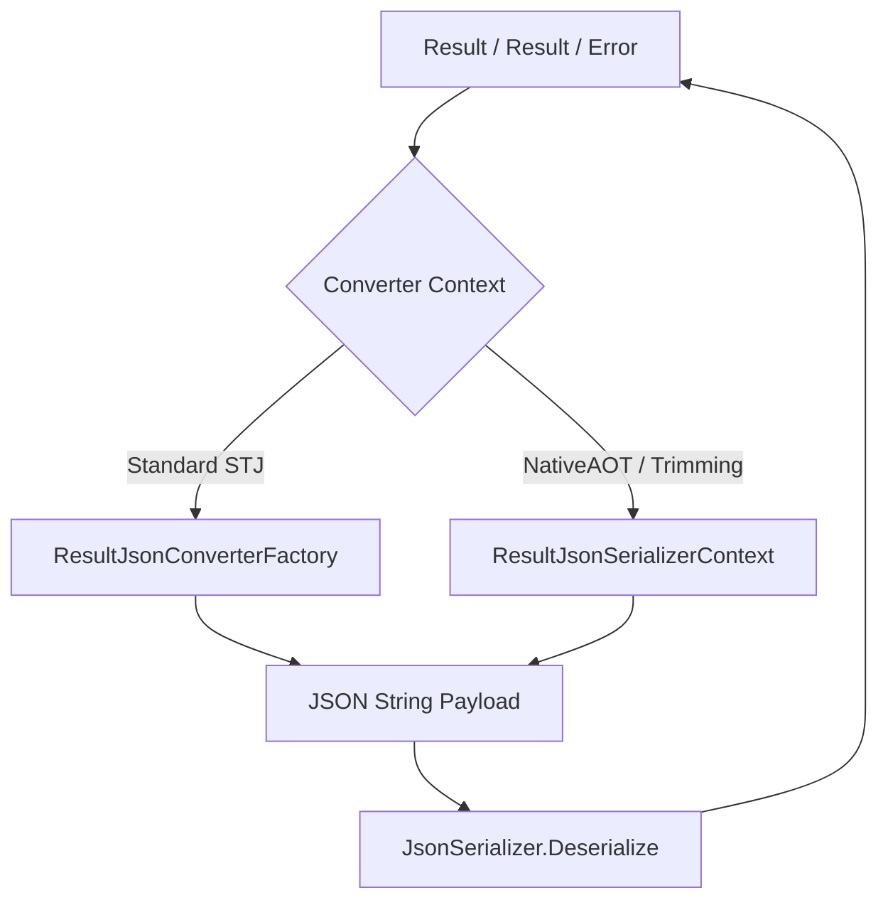
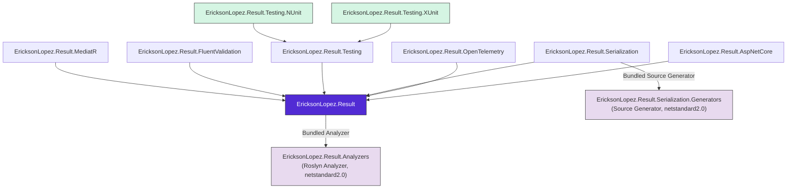

# Architectural Overview

This document describes the design principles, structural models, telemetry integration, and execution pipelines of `EricksonLopez.Result`.

---

## 1. Clean Architecture & Result Flow

In Clean Architecture and Domain-Driven Design (DDD), domain rules and business invariants should communicate failures as domain values rather than control-flow exceptions.



---

## 2. Railway-Oriented Pipeline Flow

Monadic chaining allows operations to execute in sequence on the **Success Track**, while automatically short-circuiting to the **Failure Track** if any step evaluates to a failure.

```mermaid
flowchart TD
    Start[Input Data] --> Ensure{Ensure(predicate)}
    Ensure -- Pass --> Bind[Bind(Async Service Call)]
    Ensure -- Fail --> FailTrack[Return Result.Failure]
    
    Bind -- Success --> Map[Map(To DTO)]
    Bind -- Failure --> FailTrack
    
    Map --> Tap[Tap(Side Effects / Cache / Logging)]
    Tap --> Match{Match / ToHttpResult}
    
    Match -- Success --> OkRes[200 OK / Success Value]
    Match -- Failure --> ProbRes[RFC 9457 ProblemDetails]
    
    style FailTrack fill:#ff9999,stroke:#333,stroke-width:2px
    style OkRes fill:#99ccff,stroke:#333,stroke-width:2px
    style ProbRes fill:#ffcc99,stroke:#333,stroke-width:2px
```

---

## 3. Readonly Struct Memory & State Layout

Both `Result` and `Result<TValue>` are implemented as `readonly struct` value types to eliminate heap allocation overhead for the Result envelope itself.

```mermaid
stateDiagram-v8
    [*] --> Uninitialized: default(Result) / default(Result<T>)
    Uninitialized --> Success: Result.Success() / Result.Success(value)
    Uninitialized --> Failure: Result.Failure(error)
    
    state Success {
        IsSuccess: true
        IsFailure: false
        Value: Valid Instance
        Error: Throws InvalidOperationException
    }
    
    state Failure {
        IsSuccess: false
        IsFailure: true
        Value: Throws InvalidOperationException
        Error: Valid Error Instance
    }

    state Uninitialized {
        IsUninitialized: true
        Value: Throws InvalidOperationException
        Error: Returns WellKnownErrors.UninitializedError
    }
```

### Memory Footprint Comparison

| Component | Type | Heap Allocation |
|---|---|---|
| `Result` Envelope | `readonly struct` | **0 bytes** (allocated on stack or CPU register) |
| `Result<TValue>` Envelope | `readonly struct` | **0 bytes** (stack / register) |
| `TValue` (Value Type e.g., `int`, `Guid`) | `struct` | **0 bytes** (stored inline within struct) |
| `TValue` (Reference Type e.g., `User`) | `class` | Allocated on heap when instantiated |
| `Error` | `class` | Heap allocated on failure path only (0 allocation on success) |

---

## 4. ASP.NET Core HTTP Mapping Architecture

`EricksonLopez.Result.AspNetCore` integrates with ASP.NET Core via `.ToHttpResult()` and `ResultEndpointFilter`.

```mermaid
flowchart LR
    Res[Result / Result<T>] --> Filter[ResultEndpointFilter / ToHttpResult]
    Filter --> Check{IsSuccess?}
    Check -- Yes --> HTTP200[Results.Ok(value) / Results.NoContent()]
    Check -- No --> MapError[Map ErrorType to HTTP Code]
    
    MapError --> V[Validation -> 400 Bad Request]
    MapError --> U[Unauthorized -> 401 Unauthorized]
    MapError --> F[Forbidden -> 403 Forbidden]
    MapError --> NF[NotFound -> 404 Not Found]
    MapError --> C[Conflict -> 409 Conflict]
    MapError --> S[Unavailable -> 503 Service Unavailable]
    MapError --> E[Failure/Unexpected -> 500 Server Error]

    V & U & F & NF & C & S & E --> ProbDetails[RFC 9457 ProblemDetails Payload]
```

---

## 5. OpenTelemetry Activity & Metrics Pipeline

`EricksonLopez.Result.OpenTelemetry` attaches diagnostic attributes directly to OpenTelemetry `ActivitySource` spans and updates runtime `Meter` statistics:



---

## 6. System.Text.Json Serialization Architecture

`EricksonLopez.Result.Serialization` utilizes custom polymorphic converter factories and NativeAOT `JsonSerializerContext` generation:



---

## 7. Asynchronous State Machine Wrapper Pattern

To maximize compatibility with asynchronous instrumentation tools (e.g. Coverlet, OpenTelemetry automatic instrumentation) and prevent testing deadlocks when dealing with ValueTask, the library heavily relies on a specific state-machine splitting architectural pattern.

When the compiler generates an IAsyncStateMachine for an sync ValueTask method, instrumentation tools sometimes insert breakpoints in branches that lock the test runner's thread context, especially in Release mode. 
To bypass this and achieve robust test coverage, asynchronous methods are separated into a public wrapper that evaluates synchronicity, and a private sync Task method that executes the slow path:

```csharp
// 1. The Public Wrapper (No 'async' modifier, returns ValueTask)
public static ValueTask<Result> MapAsync(this ValueTask<Result> task, Func<Result> next)
{
    // Fast path: if the ValueTask is already completed, process synchronously.
    // This avoids creating an IAsyncStateMachine allocation entirely.
    if (task.IsCompletedSuccessfully)
    {
        return new ValueTask<Result>(task.Result.Map(next));
    }
    
    // Slow path: delegate to the core Task method
    return new ValueTask<Result>(MapCore(task, next));
}

// 2. The Private Core Method (Generates the IAsyncStateMachine)
private static async Task<Result> MapCore(ValueTask<Result> task, Func<Result> next)
{
    var result = await task.ConfigureAwait(false);
    return result.Map(next);
}
```

This pattern ensures that:
1. **Performance is Optimized:** Synchronous completions never allocate a state machine.
2. **Deadlocks are Avoided:** The generated state machine returns a Task, which is perfectly handled by all diagnostic tools without thread locking.

---

## Known Limitations

### ResultEndpointFilter and OpenAPI Type Metadata

When using `ResultEndpointFilter`, the filter accesses the success value via `IResultOutcome.RawValue`, which returns `object?`. This means:

1. **Value type boxing**: If `Result<T>` contains a value type (e.g., `int`, `Guid`), it is boxed when accessed through `RawValue`.
2. **OpenAPI/Swagger**: `TypedResults.Ok(object?)` returns `Ok<object?>`, not `Ok<T>`. Swagger/OpenAPI metadata will show `object` instead of the concrete response type.

**Workarounds:**
- Call `.ToHttpResult()` directly from your handler instead of relying on the endpoint filter.
- Use `.Produces<T>()` on the endpoint to explicitly declare the response type for OpenAPI.

This limitation is inherent to polymorphic dispatch via `IResultOutcome` and cannot be resolved without reflection or source generators in the filter layer.

### Metadata Serialization Round-Trip

Error metadata values are serialized preserving native JSON types (numbers, booleans, strings, arrays). However, the round-trip is **partially lossy**:

- `int` values are deserialized as `long` (JSON numbers have no int/long distinction).
- `float` values are deserialized as `double`.
- Complex objects are serialized via `ToString()` and deserialized as `string`.

For type-faithful metadata, use typed DTOs on your domain objects instead of relying on `Error.Metadata`.

---

## 8. Project Dependency Graph

The following diagram shows the internal project references within the `EricksonLopez.Result` ecosystem:



---

## 9. Roslyn Analyzers Architecture

`EricksonLopez.Result.Analyzers` is a Roslyn diagnostic analyzer project targeting `netstandard2.0`. It is bundled as an `OutputItemType="Analyzer"` reference from the core package and provides three compile-time diagnostics:

| Diagnostic | Category | Severity | What It Detects |
|---|---|---|---|
| `RESULT001` | Performance | Warning | `Result<T>` used with a struct >64 bytes |

| `RESULT003` | Usage | Warning | `ErrorBuilder.With*()` return value discarded (struct mutation lost) |

All analyzers use `RegisterOperationAction` or `RegisterSymbolAction` for incremental, concurrent analysis.

---

## 10. Source Generator Architecture

`EricksonLopez.Result.Serialization.Generators` is a Roslyn incremental source generator targeting `netstandard2.0`. It generates AOT-compatible `ResultOfTJsonConverter<T>` implementations at compile time, eliminating the need for reflection-based `MakeGenericType` / `Activator.CreateInstance` calls in `ResultJsonConverterFactory`.

The generator is bundled as a dev dependency (`DevelopmentDependency=true`) into the `EricksonLopez.Result.Serialization` package via `OutputItemType="Analyzer"` and `ReferenceOutputAssembly="false"`. Its output goes to `analyzers/dotnet/cs` inside the NuGet package.
