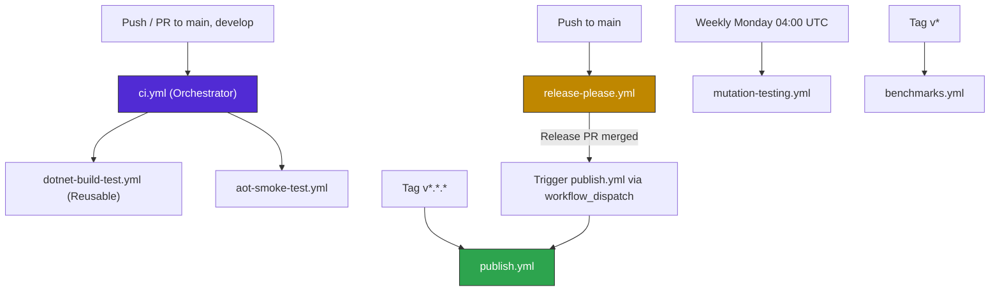
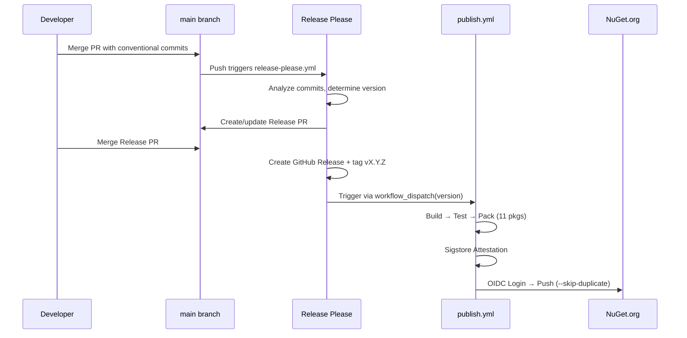

# CI/CD Pipeline & Release Strategy

This document describes the GitHub Actions workflows, build process, release strategy, dependency management, and supply chain security measures for the `EricksonLopez.Result` ecosystem.

---

## Workflows Overview

The project uses seven GitHub Actions workflow files:

| Workflow | File | Trigger | Purpose |
|---|---|---|---|
| CI | `ci.yml` | Push/PR to `main`, `develop` | Orchestrator — calls reusable build-test and AOT workflows |
| Reusable Build & Test | `dotnet-build-test.yml` | `workflow_call` | Restore → Build → Test → Coverage → SonarCloud |
| NativeAOT Smoke Test | `aot-smoke-test.yml` | `workflow_call`, push/PR, manual | Validates NativeAOT compatibility via `PublishAot=true` |
| Publish NuGet | `publish.yml` | Tag `v*.*.*`, `workflow_dispatch` | Pack → Test → Attest → OIDC Publish → GitHub Release |
| Release Please | `release-please.yml` | Push to `main` | Automated versioning, CHANGELOG, and release PR management |
| Mutation Testing | `mutation-testing.yml` | `workflow_dispatch`, weekly cron | Stryker.NET mutation testing with quality gate |
| Benchmarks | `benchmarks.yml` | `workflow_dispatch`, tag `v*` | BenchmarkDotNet baseline capture and commit |

### Workflow Dependency Diagram



---

## CI Workflow (`ci.yml`)

**Trigger:** `push` and `pull_request` on branches `main` and `develop`.

Orchestrates two parallel jobs by calling reusable workflows:

| Job | Calls | Purpose |
|---|---|---|
| `build-and-test` | `dotnet-build-test.yml@main` | Full build, test, coverage, SonarCloud |
| `aot-smoke-test` | `aot-smoke-test.yml@main` | NativeAOT publish validation |

| Input | Value |
|---|---|
| `artifact-name` | `test-results` |

| Secret | Required | Description |
|---|---|---|
| `SNK_KEY` | Yes | Base64-encoded Strong Name key for assembly signing |
| `CODECOV_TOKEN` | Yes | Codecov upload token |
| `SONAR_TOKEN` | Yes | SonarCloud analysis token |

---

## Reusable Build & Test Workflow (`dotnet-build-test.yml`)

**Trigger:** `workflow_call` (reusable workflow).

### Inputs

| Input | Type | Default | Description |
|---|---|---|---|
| `dotnet-version` | string | `10.0.x` | .NET SDK version |
| `test-filter` | string | `""` | Test filter expression |
| `test-project` | string | `""` | Specific test project path |
| `upload-coverage` | boolean | `true` | Upload coverage artifacts |
| `artifact-name` | string | `test-results` | Test results artifact name |

### Secrets

| Secret | Required | Description |
|---|---|---|
| `SNK_KEY` | No | Base64-encoded `.snk` key |
| `CODECOV_TOKEN` | No | Codecov upload token |
| `SONAR_TOKEN` | No | SonarCloud token |

### Pipeline Steps



```mermaid
flowchart LR
    Checkout[Checkout] --> SDK[Setup .NET 10.0.x]
    SDK --> SNK[Restore SNK Key]
    SNK --> Restore[dotnet restore]
    Restore --> Java[Setup Java 17]
    Java --> Sonar[Install SonarScanner]
    Sonar --> SonarBegin[Begin Sonar Analysis]
    SonarBegin --> Build[dotnet build Release]
    Build --> Test[dotnet test + Coverage]
    Test --> SonarEnd[End Sonar Analysis]
    SonarEnd --> Upload[Upload Test Results]
    Upload --> Codecov[Upload to Codecov]
```

### Artifacts Produced

- `test-results/` — TRX test results, OpenCover and Cobertura coverage XML

---

## NativeAOT Smoke Test Workflow (`aot-smoke-test.yml`)

**Trigger:** `workflow_call` (from `ci.yml`), `push`/`pull_request` on `main`/`develop`, `workflow_dispatch`.

**Purpose:** Validates that `IsAotCompatible=true` is not just a declaration — packages actually compile and run under NativeAOT (`PublishAot=true`). Uses .NET 8.0 SDK (LTS) with the `EricksonLopez.Result.AotSmokeTest` console app targeting `net8.0`.

### Pipeline Steps

1. Checkout → Setup .NET 8.0.x → Restore SNK Key
2. Install NativeAOT prerequisites (`clang`, `lld`, `zlib`)
3. Restore → Build (Release)
4. `dotnet publish` with `PublishAot=true` and `TreatWarningsAsErrors=true`
5. Execute the published native binary (exit code 0 = pass)
6. Upload AOT artifacts on failure

**Key behavior:** IL2026 / IL3050 warnings from the ILC trimmer are treated as build errors, ensuring genuine AOT compatibility.

---

## Release Please Workflow (`release-please.yml`)

**Trigger:** `push` to `main`.

**Purpose:** Automates version management and CHANGELOG generation using [Conventional Commits](https://www.conventionalcommits.org).

### How It Works

1. On every push to `main`, analyzes commit messages using Conventional Commits.
2. Determines the next SemVer version:
   - `fix:` → PATCH bump (1.0.0 → 1.0.1)
   - `feat:` → MINOR bump (1.0.0 → 1.1.0)
   - `feat!:` or `BREAKING CHANGE:` → MAJOR bump (1.0.0 → 2.0.0)
3. Creates/updates a Release PR containing a version bump in `Directory.Build.props` and CHANGELOG update.
4. When merged, creates a GitHub Release + tag `vX.Y.Z`.
5. Triggers `publish.yml` via `workflow_dispatch` with the resolved version.

### Configuration

- Config: `.release-please-config.json`
- Manifest: `.release-please-manifest.json`
- Version source: `Directory.Build.props` → `<VersionPrefix>` (updated via XPath)
- Tag format: `v{version}` (e.g., `v1.0.0`)

### Permissions

```yaml
permissions:
  contents: write
  pull-requests: write
```

---

## Publish Workflow (`publish.yml`)

**Trigger:** Push of tag matching `v*.*.*` (legacy) or `workflow_dispatch` (from Release Please or manual).

### Version Resolution Priority

1. `workflow_dispatch` input `version` (from Release Please)
2. Git tag `v*.*.*` (strip `v` prefix)
3. Fallback: `<VersionPrefix>` from `Directory.Build.props`

### Pipeline Steps



```mermaid
flowchart LR
    Checkout[Checkout] --> Version[Resolve Version]
    Version --> SDK[Setup .NET 10.0.x]
    SDK --> SNK[Restore SNK Key]
    SNK --> Restore[dotnet restore]
    Restore --> Build[dotnet build Release]
    Build --> Test[dotnet test + Coverage]
    Test --> Pack["dotnet pack × 11 packages"]
    Pack --> Attest[Sigstore Provenance v2]
    Attest --> Login[NuGet OIDC Login]
    Login --> Push[dotnet nuget push]
    Push --> Release[Create GitHub Release]
```

### Permissions Required

```yaml
permissions:
  id-token: write      # NuGet OIDC Trusted Publishing + Sigstore
  contents: write       # GitHub Release creation
  attestations: write   # Sigstore Provenance
```

### Packages Published (11 total)

All packages are packed and published to NuGet.org in a single workflow run:

| # | Package |
|---|---|
| 1 | `EricksonLopez.Result` |
| 2 | `EricksonLopez.Result.AspNetCore` |
| 3 | `EricksonLopez.Result.OpenTelemetry` |
| 4 | `EricksonLopez.Result.Serialization` |
| 5 | `EricksonLopez.Result.Serialization.Generators` |
| 6 | `EricksonLopez.Result.FluentValidation` |
| 7 | `EricksonLopez.Result.MediatR` |
| 8 | `EricksonLopez.Result.Testing` |
| 9 | `EricksonLopez.Result.Testing.XUnit` |
| 10 | `EricksonLopez.Result.Testing.NUnit` |
| 11 | `EricksonLopez.Result.Analyzers` |

> **Note:** `EricksonLopez.Result.Analyzers` is packed independently AND also bundled as an analyzer reference inside the core `EricksonLopez.Result` package.

### Pre-Release Detection

The workflow determines pre-release status using: `prerelease: ${{ contains(steps.version.outputs.VERSION, '-') }}`. Tags like `v1.0.0-preview.1` produce a pre-release GitHub Release.

---

## Mutation Testing Workflow (`mutation-testing.yml`)

**Trigger:** `workflow_dispatch` (manual with mutation level selection) and weekly `schedule` (Monday 04:00 UTC).

**Purpose:** Runs Stryker.NET mutation testing against the `EricksonLopez.Result` core package. The mutation score is gated by thresholds in `stryker-config.json`:

| Gate | Threshold | Behavior |
|---|---|---|
| High | ≥ 100% | Green — all good |
| Low | ≥ 98% | Yellow — investigate |
| Break | < 95% | **CI fails** (non-zero exit) |

### Inputs

| Input | Type | Default | Options |
|---|---|---|---|
| `mutation-level` | choice | `Standard` | Basic, Standard, Advanced |

### Artifacts

- `stryker-report-{run_id}/` — HTML, JSON, and cleartext mutation reports (retained 30 days)

---

## Benchmarks Workflow (`benchmarks.yml`)

**Trigger:** `workflow_dispatch` (manual with filter and commit options) and `push` on tags `v*`.

**Purpose:** Runs BenchmarkDotNet benchmarks across .NET 8 and .NET 10 runtimes and commits results to `benchmarks/results/` for version-over-version regression tracking.

### Inputs

| Input | Type | Default | Description |
|---|---|---|---|
| `benchmark-filter` | string | `*` | BenchmarkDotNet filter glob |
| `commit-results` | choice | `true` | Whether to commit results back |

### Behavior

- Installs both .NET 8.0.x and .NET 10.0.x SDKs for cross-TFM comparison
- Runs with `--job short` (3 warmup + 3 measurement iterations)
- Exports JSON and Markdown reports
- Commits results to `benchmarks/results/` with `[skip ci]` marker

---

## Branch Strategy

Based on workflow triggers, the repository uses two primary branches:

| Branch | Purpose | CI Trigger | Dependabot Target |
|---|---|---|---|
| `main` | Stable production branch | Push + PR | — |
| `develop` | Active development branch | Push + PR | ✅ (NuGet + GitHub Actions) |

Feature branches are merged into `develop` or `main` via Pull Requests.

---

## Dependency Management

### Dependabot (`.github/dependabot.yml`)

Dependabot is configured for two ecosystems targeting the `develop` branch:

| Ecosystem | Schedule | Target Branch | PR Limit |
|---|---|---|---|
| NuGet | Weekly (Monday 09:00 ET) | `develop` | 10 |
| GitHub Actions | Monthly (Monday 09:00 ET) | `develop` | 5 |

**NuGet dependency groups:**

| Group | Patterns |
|---|---|
| `microsoft-extensions` | `Microsoft.Extensions.*` |
| `system-libs` | `System.*` |
| `fluentvalidation` | `FluentValidation*` |
| `mediatr` | `MediatR*` |
| `opentelemetry` | `OpenTelemetry*` |
| `xunit` | `xunit*`, `xunit.*` |
| `stryker` | `dotnet-stryker*`, `Stryker*` |
| `roslyn` | `Microsoft.CodeAnalysis*` |

### NuGet Security Auditing

`Directory.Build.props` enables NuGet's built-in security audit:

```xml
<NuGetAudit>true</NuGetAudit>
<NuGetAuditMode>all</NuGetAuditMode>
<NuGetAuditLevel>low</NuGetAuditLevel>
```

---

## Release Strategy

### Versioning

- **Semantic Versioning** (`MAJOR.MINOR.PATCH`) is enforced via Conventional Commits + Release Please.
- `VersionPrefix` is centrally defined in `Directory.Build.props` (current: `1.0.0`).
- At publish time, `VersionPrefix` is overridden from the resolved version: `-p:VersionPrefix=1.2.3`.
- `VersionSuffix` is empty by default (set by Release Please for pre-releases).

### Automated Release Flow (Primary)



### Manual Release Flow (Legacy)

1. Developer pushes a tag: `git tag v1.0.0 && git push --tags`
2. `publish.yml` triggers on tag push
3. Version extracted by stripping `v` prefix
4. Same Pack → Test → Attest → Publish pipeline

---

## Supply Chain Security

### Sigstore Provenance Attestation

The `publish.yml` workflow generates [Sigstore](https://www.sigstore.dev/) provenance attestations for all `.nupkg` files using `actions/attest-build-provenance@v2` (SLSA v1.0 predicate format). Consumers can verify via:

```bash
gh attestation verify <package.nupkg> --repo ericksonlopez/dotnet-result
```

### NuGet Trusted Publishing (OIDC)

Instead of a static NuGet API key stored as a secret, the workflow uses `NuGet/login@v1` with OIDC authentication (`id-token: write` permission). The short-lived token is scoped to this specific repository and workflow, eliminating the risk of leaked long-lived API keys.

### Strong Name Signing

All assemblies are signed with a strong name key (`EricksonLopez.Result.snk`). The key is stored as a base64-encoded GitHub secret (`SNK_KEY`) and restored at build time. Signing is conditional — if the `.snk` file is not present (e.g., open-source contributor without the secret), builds succeed without signing.

---

## Secrets Inventory

| Secret | Used In | Purpose |
|---|---|---|
| `SNK_KEY` | `ci.yml`, `publish.yml`, `aot-smoke-test.yml`, `mutation-testing.yml`, `benchmarks.yml` | Base64-encoded Strong Name key |
| `CODECOV_TOKEN` | `ci.yml` (via `dotnet-build-test.yml`), `publish.yml` | Codecov coverage upload |
| `SONAR_TOKEN` | `ci.yml` (via `dotnet-build-test.yml`) | SonarCloud static analysis |
| `GITHUB_TOKEN` | `dotnet-build-test.yml`, `publish.yml`, `release-please.yml`, `benchmarks.yml` | Automatic — SonarCloud PR decoration, GitHub Release creation, benchmark result commits |

> **Note:** NuGet.org authentication uses OIDC via `NuGet/login@v1` — no `NUGET_API_KEY` secret is required.
