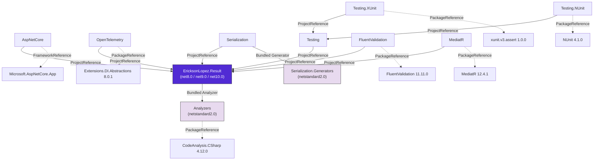

# Package Reference

Comprehensive reference for all NuGet packages in the `EricksonLopez.Result` ecosystem, including target frameworks, dependencies, AOT compatibility, and package relationships.

---

## Packages Overview

The ecosystem ships **11 NuGet packages**, all versioned in lockstep from a single `VersionPrefix` in `Directory.Build.props`.

| Package | Type | Target Frameworks | AOT | Trimmable |
|---|---|---|---|---|
| `EricksonLopez.Result` | Core library | net8.0; net9.0; net10.0 | ✅ | ✅ |
| `EricksonLopez.Result.Analyzers` | Roslyn analyzer | netstandard2.0 | N/A | N/A |
| `EricksonLopez.Result.AspNetCore` | Framework integration | net8.0; net9.0; net10.0 | ✅ | ✅ |
| `EricksonLopez.Result.FluentValidation` | Library integration | net8.0; net9.0; net10.0 | ✅ | ✅ |
| `EricksonLopez.Result.MediatR` | Library integration | net8.0; net9.0; net10.0 | ❌ | ❌ |
| `EricksonLopez.Result.OpenTelemetry` | Observability | net8.0; net9.0; net10.0 | ✅ | ✅ |
| `EricksonLopez.Result.Serialization` | JSON support | net8.0; net9.0; net10.0 | ⚠️ Partial | ⚠️ Partial |
| `EricksonLopez.Result.Serialization.Generators` | Source generator | netstandard2.0 | ✅ | ✅ |
| `EricksonLopez.Result.Testing` | Test helpers | net8.0; net9.0; net10.0 | ✅ | ✅ |
| `EricksonLopez.Result.Testing.NUnit` | Test helpers (NUnit) | net8.0; net9.0; net10.0 | ❌ | ❌ |
| `EricksonLopez.Result.Testing.XUnit` | Test helpers (xUnit) | net8.0; net9.0; net10.0 | ❌ | ❌ |

---

## Dependency Graph

---

## Per-Package Details

### `EricksonLopez.Result`

The core package providing `Result`, `Result<TValue>`, `Error`, `ErrorBuilder`, monadic pipeline operators, LINQ extensions, and `IResultOutcome`.

| Property | Value |
|---|---|
| TFMs | `net8.0`; `net9.0`; `net10.0` |
| AOT Compatible | ✅ Yes |
| Trimmable | ✅ Yes |
| Strong Named | ✅ Conditional (when `.snk` present) |
| XML Docs | ✅ Generated |
| Bundled | `EricksonLopez.Result.Analyzers` (as `OutputItemType="Analyzer"`) |
| Public API Tracking | `PublicAPI.Shipped.txt` / `PublicAPI.Unshipped.txt` |
| InternalsVisibleTo | `Serialization`, `AspNetCore`, `OpenTelemetry`, `Tests` |

**Dependencies:** `Microsoft.SourceLink.GitHub 8.0.0` (build-only), `Microsoft.CodeAnalysis.PublicApiAnalyzers 3.3.4` (build-only)

---

### `EricksonLopez.Result.Analyzers`

Roslyn diagnostic analyzers and code fix providers bundled with the Core package. Targets `netstandard2.0` for maximum IDE/build host compatibility.

| Property | Value |
|---|---|
| TFM | `netstandard2.0` |
| Package Type | Development dependency (`DevelopmentDependency=true`) |
| Build Output | `analyzers/dotnet/cs` (not `lib/`) |
| Roslyn Component | ✅ `IsRoslynComponent=true` |

**Diagnostics:**

| ID | Severity | Description |
|---|---|---|
| `RESULT001` | Warning | `Result<T>` used with a struct larger than 64 bytes — copy overhead |
| `RESULT003` | Error | `ErrorBuilder.With*()` return value discarded — struct mutation lost |
| `RESULT004` | Warning | Lambda captures outer variable in Result pipeline (closure allocation) |
| `RESULT005` | Warning | `Error.WithMetadata()` chained in a loop without batching |
| `RESULT006` | Warning | Excessive `WithInnerError()` chaining depth |
| `RESULT007` | Warning | `HashSet<Error>` / `Distinct()` / `GroupBy()` without `ErrorEqualityComparer.Strict` |
| `RESULT008` | Warning | `AddResultEndpointFilter()` without `.Produces<T>()` — OpenAPI degradation |
| `RESULT009` | Warning | `IncludeDescription = true` without environment guard — security |

**Code Fixes:** `ClosureCaptureCodeFix` (RESULT004), `ErrorBuilderDiscardedReturnCodeFix` (RESULT003)

**Dependencies:** `Microsoft.CodeAnalysis.CSharp 4.12.0`, `Microsoft.CodeAnalysis.Analyzers 3.3.4`, `Microsoft.CodeAnalysis.Workspaces.Common 4.12.0`

---

### `EricksonLopez.Result.AspNetCore`

ASP.NET Core integration providing `ToHttpResult()`, `ResultEndpointFilter`, `ResultHttpOptions`, and RFC 9457 ProblemDetails formatting.

| Property | Value |
|---|---|
| TFMs | `net8.0`; `net9.0`; `net10.0` |
| AOT Compatible | ✅ Yes |
| Framework Ref | `Microsoft.AspNetCore.App` |

**Dependencies:** Core (project reference)

---

### `EricksonLopez.Result.OpenTelemetry`

OpenTelemetry `ActivitySource` tracing integration (`RecordResult()`) and `System.Diagnostics.Metrics` counters (`ResultMetrics`).

| Property | Value |
|---|---|
| TFMs | `net8.0`; `net9.0`; `net10.0` |
| AOT Compatible | ✅ Yes |
| Bundled | `Serialization.Generators` (for compile-time version constant) |

**Dependencies:** Core (project reference), `Microsoft.Extensions.DependencyInjection.Abstractions 8.0.1`

---

### `EricksonLopez.Result.Serialization`

`System.Text.Json` custom converters for `Result`, `Result<T>`, and `Error`. Includes both reflection-based `ResultJsonConverterFactory` and AOT-safe explicit converters.

| Property | Value |
|---|---|
| TFMs | `net8.0`; `net9.0`; `net10.0` |
| AOT Compatible | ⚠️ Partial — `ResultJsonConverterFactory` uses `MakeGenericType`; use `ResultOfTJsonConverter<T>` for AOT |
| Bundled | `Serialization.Generators` (as `OutputItemType="Analyzer"`) |

**Dependencies:** Core (project reference)

---

### `EricksonLopez.Result.Serialization.Generators`

Roslyn incremental source generator producing AOT-compatible `ResultOfTJsonConverter<T>` implementations at compile time. Also generates version constants for the OpenTelemetry package.

| Property | Value |
|---|---|
| TFM | `netstandard2.0` |
| Package Type | Development dependency (`DevelopmentDependency=true`) |
| Build Output | `analyzers/dotnet/cs` |

**Dependencies:** `Microsoft.CodeAnalysis.CSharp 4.12.0`, `Microsoft.CodeAnalysis.Analyzers 3.3.4`

---

### `EricksonLopez.Result.FluentValidation`

Converts `FluentValidation.ValidationResult` to structured `Result` failures. Provides `ToResult()`, `ToResult(T)`, and `EnsureValid()` pipeline integration.

| Property | Value |
|---|---|
| TFMs | `net8.0`; `net9.0`; `net10.0` |
| AOT Compatible | ✅ Yes |

**Dependencies:** Core (project reference), `FluentValidation 11.11.0`

---

### `EricksonLopez.Result.MediatR`

MediatR pipeline behavior (`ResultExceptionBehavior<TRequest, TResponse>`) that catches unhandled exceptions and wraps them as `Result` failures.

| Property | Value |
|---|---|
| TFMs | `net8.0`; `net9.0`; `net10.0` |
| AOT Compatible | ❌ No — MediatR uses reflection internally |

**Dependencies:** Core (project reference), `MediatR 12.4.1`

---

### `EricksonLopez.Result.Testing`

Framework-agnostic fluent testing assertion library. Provides `ShouldBeSuccess()`, `ShouldBeFailure()`, `ShouldHaveError()`, and async variants.

| Property | Value |
|---|---|
| TFMs | `net8.0`; `net9.0`; `net10.0` |
| AOT Compatible | ✅ Yes |

**Dependencies:** Core (project reference)

---

### `EricksonLopez.Result.Testing.XUnit`

xUnit-specific testing helpers. Assertion failures surface as `Xunit.Sdk.XunitException` (from xUnit v3), ensuring clean "Failure" (not "Error") reporting in xUnit's test output.

| Property | Value |
|---|---|
| TFMs | `net8.0`; `net9.0`; `net10.0` |
| AOT Compatible | ❌ No — xUnit.core is not AOT-compatible |

**Dependencies:** `Testing` (project reference), `xunit.v3.assert 1.0.0`

---

### `EricksonLopez.Result.Testing.NUnit`

NUnit-specific testing helpers. Assertion failures surface as NUnit's `AssertionException` for correct test runner integration.

| Property | Value |
|---|---|
| TFMs | `net8.0`; `net9.0`; `net10.0` |
| AOT Compatible | ❌ No — NUnit runner is not AOT-compatible |

**Dependencies:** `Testing` (project reference), `NUnit 4.1.0`

---

## NativeAOT & Trimming Compatibility Matrix

| Package | NativeAOT | Trimmable | Notes |
|---|---|---|---|
| `Result` | ✅ | ✅ | Zero reflection in hot paths |
| `Analyzers` | N/A | N/A | Build-time only (Roslyn analyzer) |
| `AspNetCore` | ✅ | ✅ | Compatible with STJ Source Generators |
| `OpenTelemetry` | ✅ | ✅ | Native `Activity` API, version via source generator |
| `Serialization` | ⚠️ Partial | ⚠️ Partial | `ResultJsonConverterFactory` uses `MakeGenericType`; use explicit `ResultOfTJsonConverter<T>` |
| `Serialization.Generators` | ✅ | ✅ | Compile-time only (source generator) |
| `FluentValidation` | ✅ | ✅ | No reflection in library code |
| `MediatR` | ❌ | ❌ | MediatR uses reflection; `CreateFailure` uses `MakeGenericMethod` |
| `Testing` | ✅ | ✅ | Test libraries not deployed in AOT production |
| `Testing.XUnit` | ❌ | ❌ | xUnit.core not AOT-compatible |
| `Testing.NUnit` | ❌ | ❌ | NUnit runner not AOT-compatible |

---

## Build Infrastructure

### Shared Build Properties (`Directory.Build.props`)

All projects inherit from a central `Directory.Build.props`:

| Property | Value | Purpose |
|---|---|---|
| `VersionPrefix` | `1.0.0` | **Authoritative version source** |
| `LangVersion` | `latest` | Latest C# language features |
| `Nullable` | `enable` | Nullable reference types |
| `TreatWarningsAsErrors` | `true` | Zero-warning policy |
| `WarningLevel` | `5` | Maximum sensitivity |
| `AnalysisLevel` | `latest-recommended` | Latest .NET SDK analyzers |
| `EnforceCodeStyleInBuild` | `true` | Code style rules enforced |
| `Deterministic` | `true` | Reproducible builds |
| `SignAssembly` | Conditional | When `.snk` file exists |
| `NuGetAudit` | `true` | Security audit on restore |

### Strong Name Signing

All assemblies are signed with `EricksonLopez.Result.snk` when present. Signing is conditional — contributor builds without the `.snk` succeed unsigned.

### SourceLink

All packages include SourceLink metadata (`Microsoft.SourceLink.GitHub 8.0.0`) with embedded symbol packages (`.snupkg`) for step-through debugging from NuGet.
