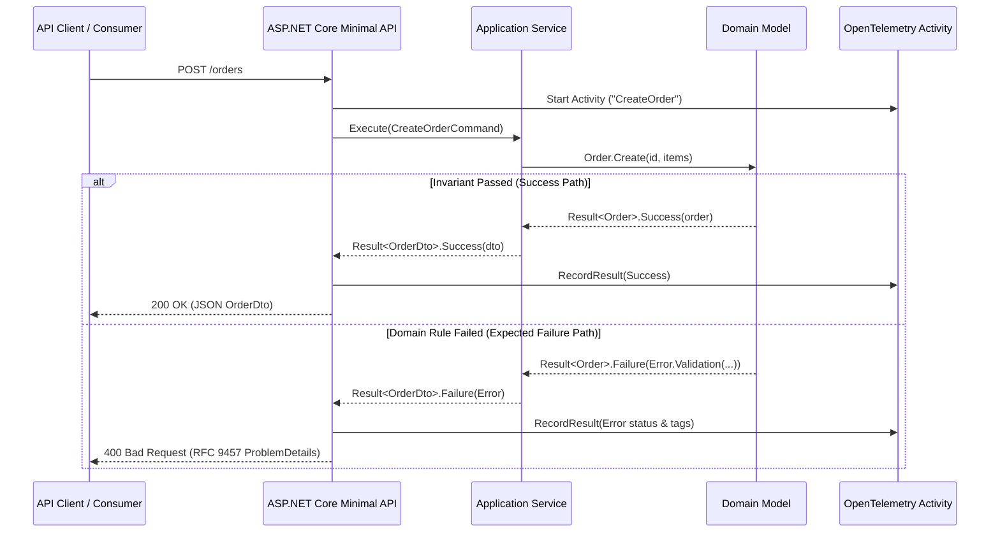
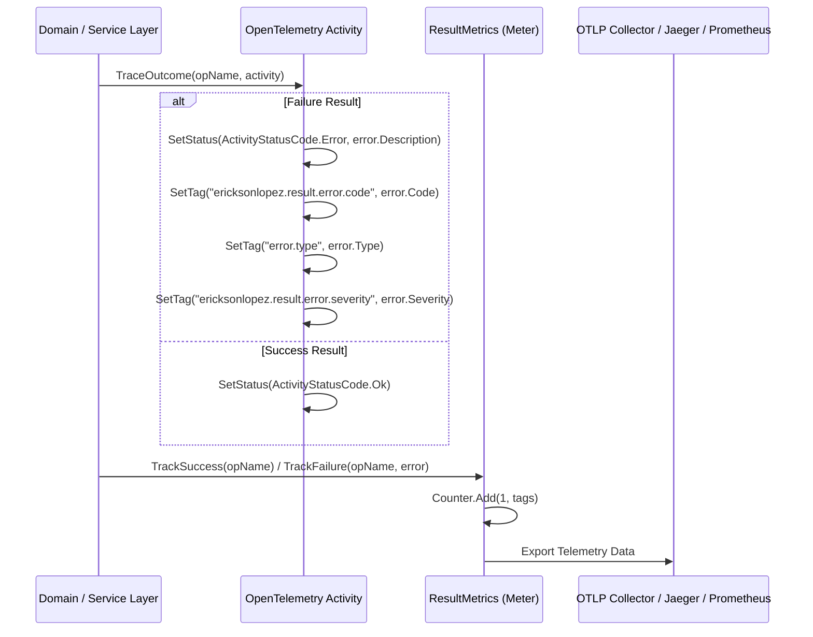
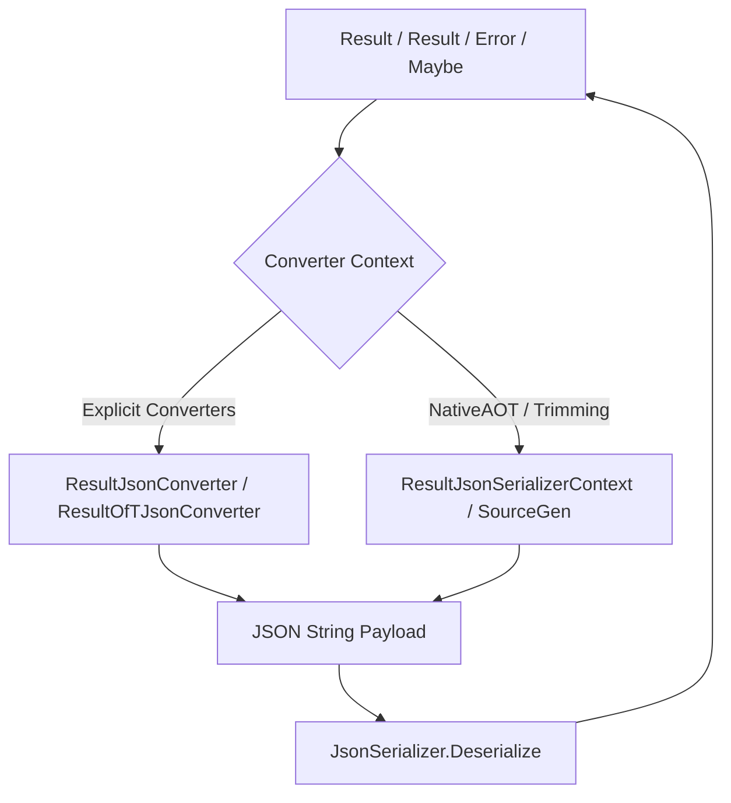

# Architecture & Design Overview

This document describes the architectural principles, structural models, telemetry integration, and execution pipelines of the `EricksonLopez.Result` ecosystem.

---

## 1. Clean Architecture & Result Flow

In Clean Architecture and Domain-Driven Design (DDD), domain rules, validation logic, and business invariants communicate expected failures as domain values rather than control-flow exceptions.



---

## 2. Railway-Oriented Programming (ROP) Pipeline Flow

Monadic chaining allows operations to execute in sequence on the **Success Track**, while automatically short-circuiting to the **Failure Track** if any step evaluates to a failure.

```mermaid
flowchart TD
    Start[Input Data] --> Ensure{Ensure(predicate)}
    Ensure -- Pass --> Bind[Bind(Async Service Call)]
    Ensure -- Fail --> FailTrack[Return Result.Failure]
    
    Bind -- Success --> Map[Map(To DTO)]
    Bind -- Failure --> FailTrack
    
    Map --> Tap[Tap(Side Effects / Cache / Logging)]
    Tap --> Match{Match / ToHttpResult}
    
    Match -- Success --> OkRes[200 OK / Success Value]
    Match -- Failure --> ProbRes[RFC 9457 ProblemDetails]
    
    style FailTrack fill:#ff9999,stroke:#333,stroke-width:2px
    style OkRes fill:#99ccff,stroke:#333,stroke-width:2px
    style ProbRes fill:#ffcc99,stroke:#333,stroke-width:2px
```

---

## 3. Readonly Struct Memory & State Layout

Both `Result` and `Result<TValue>` are implemented as `readonly struct` value types with `[StructLayout(LayoutKind.Auto)]` to eliminate heap allocation overhead on the success path.

```mermaid
stateDiagram-v8
    [*] --> Uninitialized: default(Result) / default(Result<T>)
    Uninitialized --> Success: Result.Success() / Result.Success(value)
    Uninitialized --> Failure: Result.Failure(error)
    
    state Success {
        IsSuccess: true
        IsFailure: false
        Value: Valid Instance
        Error: Throws InvalidOperationException
    }
    
    state Failure {
        IsSuccess: false
        IsFailure: true
        Value: Throws InvalidOperationException
        Error: Valid Error Instance
    }

    state Uninitialized {
        IsUninitialized: true
        Value: Throws InvalidOperationException
        Error: Returns WellKnownErrors.UninitializedError (sentinel, does NOT throw)
    }
```

### Memory Footprint Comparison

| Component | Type | Heap Allocation |
|---|---|---|
| `Result` Envelope | `readonly struct` | **0 bytes** (allocated on stack or CPU register) |
| `Result<TValue>` Envelope | `readonly struct` | **0 bytes** (stack / register) |
| `Result<TValue, TError>` | `readonly struct` | **0 bytes** (strongly-typed compile-time error) |
| `Maybe<T>` Envelope | `readonly struct` | **0 bytes** (optional DDD entity wrapper) |
| `TValue` (Value Type e.g., `int`, `Guid`) | `struct` | **0 bytes** (stored inline within struct) |
| `TValue` (Reference Type e.g., `User`) | `class` | Allocated on heap when instantiated |
| `Error` | `sealed class` | Heap allocated on failure path only (0 allocation on success) |
| `ErrorBuilder` | `readonly struct` | **0 bytes** (stack-allocated builder for compound errors) |

---

## 4. ASP.NET Core HTTP Mapping Architecture

`EricksonLopez.Result.AspNetCore` integrates with ASP.NET Core via `.ToHttpResult()` and `ResultEndpointFilter`.

```mermaid
flowchart LR
    Res[Result / Result<T>] --> Filter[ResultEndpointFilter / ToHttpResult]
    Filter --> Check{IsSuccess?}
    Check -- Yes --> HTTP200[Results.Ok(value) / Results.NoContent()]
    Check -- No --> MapError[Map ErrorType to HTTP Code]
    
    MapError --> V[Validation -> 400 Bad Request]
    MapError --> U[Unauthorized -> 401 Unauthorized]
    MapError --> F[Forbidden -> 403 Forbidden]
    MapError --> NF[NotFound -> 404 Not Found]
    MapError --> C[Conflict -> 409 Conflict]
    MapError --> S[Unavailable -> 503 Service Unavailable]
    MapError --> E[Failure/Unexpected -> 500 Server Error]

    V & U & F & NF & C & S & E --> ProbDetails[RFC 9457 ProblemDetails Payload]
```

---

## 5. OpenTelemetry Activity & Metrics Pipeline

`EricksonLopez.Result.OpenTelemetry` attaches diagnostic attributes directly to OpenTelemetry `ActivitySource` spans and updates runtime `Meter` statistics:



---

## 6. System.Text.Json Serialization Architecture

`EricksonLopez.Result.Serialization` utilizes custom polymorphic converter factories and NativeAOT `JsonSerializerContext` generation:



---

## 7. Asynchronous State Machine Wrapper Pattern (ADR-008)

To maximize compatibility with asynchronous code coverage and instrumentation tools (Coverlet, OpenTelemetry automatic instrumentation) and prevent testing deadlocks when dealing with `ValueTask`, the library utilizes a state-machine splitting architectural pattern.

When the compiler generates an `IAsyncStateMachine` for an `async ValueTask` method, instrumentation tools sometimes insert breakpoints in branches that lock the test runner's thread context, especially in Release mode. 

To resolve this and achieve robust test coverage, asynchronous methods are separated into a public wrapper that evaluates synchronicity, and a private `async Task` method that executes the slow path:

```csharp
// 1. The Public Wrapper (No 'async' modifier, returns ValueTask)
public static ValueTask<Result> Map(this ValueTask<Result> task, Func<Result> next)
{
    // Fast path: if the ValueTask is already completed, process synchronously.
    // This avoids creating an IAsyncStateMachine allocation entirely.
    if (task.IsCompletedSuccessfully)
    {
        return new ValueTask<Result>(task.Result.Map(next));
    }
    
    // Slow path: delegate to the core Task method
    return new ValueTask<Result>(MapCore(task, next));
}

// 2. The Private Core Method (Generates the IAsyncStateMachine)
private static async Task<Result> MapCore(ValueTask<Result> task, Func<Result> next)
{
    var result = await task.ConfigureAwait(false);
    return result.Map(next);
}
```

---

## 8. Project Dependency Graph

The following diagram shows the internal project references across all **14 ecosystem packages**:

```mermaid
graph TD
    Core["EricksonLopez.Result<br/>(net8.0; net9.0; net10.0)"]
    Analyzers["EricksonLopez.Result.Analyzers<br/>(netstandard2.0)"]
    Generic["EricksonLopez.Result.Generic<br/>(net8.0; net9.0; net10.0)"]
    Maybe["EricksonLopez.Result.Maybe<br/>(net8.0; net9.0; net10.0)"]
    AspNetCore["EricksonLopez.Result.AspNetCore<br/>(net8.0; net9.0; net10.0)"]
    OpenApi["EricksonLopez.Result.OpenApi<br/>(net8.0; net9.0; net10.0)"]
    OTel["EricksonLopez.Result.OpenTelemetry<br/>(net8.0; net9.0; net10.0)"]
    Serialization["EricksonLopez.Result.Serialization<br/>(net8.0; net9.0; net10.0)"]
    Generators["EricksonLopez.Result.Serialization.Generators<br/>(netstandard2.0)"]
    Testing["EricksonLopez.Result.Testing<br/>(net8.0; net9.0; net10.0)"]
    TestingXUnit["EricksonLopez.Result.Testing.XUnit<br/>(net8.0; net9.0; net10.0)"]
    TestingNUnit["EricksonLopez.Result.Testing.NUnit<br/>(net8.0; net9.0; net10.0)"]
    FluentVal["EricksonLopez.Result.FluentValidation<br/>(net8.0; net9.0; net10.0)"]
    MediatR["EricksonLopez.Result.MediatR<br/>(net8.0; net9.0; net10.0)"]

    Core -->|Bundled Analyzer| Analyzers
    Generic --> Core
    Maybe --> Core
    AspNetCore --> Core
    OpenApi --> Core
    OTel --> Core
    OTel --> Generators
    Serialization --> Core
    Serialization --> Generators
    Testing --> Core
    TestingXUnit --> Testing
    TestingNUnit --> Testing
    FluentVal --> Core
    MediatR --> Core

    style Core fill:#512BD4,stroke:#333,color:#fff
    style Analyzers fill:#E8DAEF,stroke:#333
    style Generators fill:#E8DAEF,stroke:#333
    style Testing fill:#D5F5E3,stroke:#333
    style TestingXUnit fill:#D5F5E3,stroke:#333
    style TestingNUnit fill:#D5F5E3,stroke:#333
```



---

## 9. Roslyn Analyzers & Source Generators Architecture

The repository includes compiler tooling projects targeting `netstandard2.0`:

### `EricksonLopez.Result.Analyzers`

Bundled directly into `EricksonLopez.Result` (as `OutputItemType="Analyzer"`).

| Diagnostic ID | Category | Severity | Description |
|---|---|---|---|
| `RESULT001` | Performance | Warning | Large value type (>32 bytes) used as `Result<T>` — excessive copying overhead. |
| `RESULT003` | Usage | **Error** | `ErrorBuilder.With*()` return value discarded — mutated struct copy is lost. |
| `RESULT004` | Performance | Warning | Lambda expression captures local variables in Result pipeline (closure allocation). |
| `RESULT005` | Performance | Warning | `Error.WithMetadata()` / `ErrorBuilder.WithMetadata()` chained consecutively 3+ times. |
| `RESULT006` | Performance | Warning | `ErrorBuilder.WithInnerError()` chained consecutively 2+ times without batching. |
| `RESULT007` | Reliability | Warning | `HashSet<Error>`, `Distinct()`, `GroupBy()`, or `ToHashSet()` used on `Error` without `ErrorEqualityComparer.Strict`. |
| `RESULT008` | Usage | Warning | Endpoint returning `Result<T>` uses `AddResultEndpointFilter()` without `.Produces<T>()`. |
| `RESULT009` | Security | Warning | `IncludeDescription = true` set without environment guard — potential information disclosure. |
| `RESULT010` | Security | Warning | `ResultExceptionBehavior` default error factory may expose internal exception type names. |
| `RESULT012` | Usage | Warning | Method returning `default(Result)` or `default(Result<T>)` — uninitialized state bug. |
| `RESULT_OTEL_001` | Observability | Info | `TraceOutcome()` called without `ResultMetrics` registered. |

### `EricksonLopez.Result.Serialization.Generators`

Incremental Roslyn Source Generator that produces:
- AOT-safe `ResultOfTJsonConverter<T>` registrations at compile time.
- Compile-time assembly version constants for the OpenTelemetry package (`ResultMetricsVersionGenerator`).
- Diagnostic `RESULT_GEN_001` (Warning) when `[JsonSerializable(typeof(Result))]` is used on non-generic `Result`.

---

## 10. Known Limitations & Mitigations

### 1. `ResultEndpointFilter` Boxing & OpenAPI Type Metadata
When using `ResultEndpointFilter`, the filter receives `IResultOutcome`, which boxes the struct result on each request and emits `Ok<object?>` internally.
- **Mitigation for OpenAPI:** Call `.ProducesResult<T>()` on the endpoint builder.
- **Mitigation for Zero-Allocation:** Call `.ToHttpResult()` directly inside the endpoint handler.

### 2. Metadata Serialization Lossiness
`Error.Metadata` serializes numeric primitives into native JSON numbers. Deserialization restores numbers as `long` or `double`.
- **Mitigation:** Use typed DTO objects or `ErrorEqualityComparer.Default` for semantic equivalence rather than strict type-identity assertions after JSON round-tripping.
