# EricksonLopez.Result Comprehensive Technical Audit

> **Audited Version:** 3.0.0 | **Ecosystem:** `EricksonLopez.Result v3.0.0` | **Status:** Enterprise Production Ready | **Language:** English

---

## 1. Executive Summary

`EricksonLopez.Result` is an enterprise-grade .NET Result Pattern and Railway-Oriented Programming (ROP) ecosystem engineered specifically for high-throughput distributed systems, Clean Architecture, and Domain-Driven Design (DDD).

### Architectural Invariants & Guarantees

1. **Zero-Allocation Happy Path**: `Result` and `Result<TValue>` are defined as `readonly struct` value types, eliminating heap allocations for successful domain operations.
2. **Rich Error Taxonomy**: Sealed, immutable `Error` model encompassing multi-dimensional metadata (`Code`, `Description`, `Type`, `Severity`, `Retryability`, `DescriptionKey`, lazy ambient `TraceId`, `CorrelationId`, `Metadata`, and `InnerErrors`).
3. **Zero-Dependency Core**: The core package (`EricksonLopez.Result`) relies exclusively on the .NET Base Class Library (BCL) with zero transitive third-party dependencies.
4. **Native AOT & Trimming-First**: Every component is strictly validated against Native AOT compilation, trimming analyzers (`EnableTrimAnalyzer=true`), and AOT smoke tests.
5. **Closure-Free Monadic Pipelines**: Monadic operators support `TState` overloads to eliminate compiler-generated closure display classes and delegate allocations in critical hot paths.
6. **Compile-Time Governance**: Comprehensive Roslyn diagnostic analyzers and CodeFix providers (RESULT001–RESULT013, RESULT_OTEL_001, RESULT_GEN_001) enforce correct monadic usage at build time.

---

## 2. Package Ecosystem & Assembly Architecture

The repository consists of modular, single-responsibility assemblies adhering to strict dependency flow:

```mermaid
graph TD
    subgraph "Core Contracts & Engine"
        Core["EricksonLopez.Result<br/><i>(readonly struct Result, Error, Monads)</i>"]
        Maybe["EricksonLopez.Result.Maybe<br/><i>(struct Maybe&lt;T&gt;)</i>"]
        Generic["EricksonLopez.Result.Generic<br/><i>(Result&lt;TValue, TError&gt;)</i>"]
        Core --> Maybe
        Core --> Generic
    end

    subgraph "Framework & Platform Adapters"
        AspNetCore["EricksonLopez.Result.AspNetCore<br/><i>(ProblemDetails, Minimal APIs)</i>"]
        OpenApi["EricksonLopez.Result.OpenApi<br/><i>(OpenAPI Schema Transformers)</i>"]
        FV["EricksonLopez.Result.FluentValidation<br/><i>(ValidationResult mapping)</i>"]
        MediatR["EricksonLopez.Result.MediatR<br/><i>(Pipeline Behaviors)</i>"]
        OTel["EricksonLopez.Result.OpenTelemetry<br/><i>(ActivitySource & Metrics)</i>"]
        EF["EricksonLopez.Result.EntityFrameworkCore<br/><i>(EF Core Interceptors & Converters)</i>"]
        Polly["EricksonLopez.Result.Polly<br/><i>(Resilience Pipelines)</i>"]
        MT["EricksonLopez.Result.MassTransit<br/><i>(Consumer Filters & Faults)</i>"]
        Dapr["EricksonLopez.Result.Dapr<br/><i>(Dapr Client & State Store)</i>"]
        Grpc["EricksonLopez.Result.Grpc<br/><i>(gRPC Status Mapping & RpcException)</i>"]
        Serialization["EricksonLopez.Result.Serialization<br/><i>(System.Text.Json Converters)</i>"]

        AspNetCore --> Core
        OpenApi --> Core
        FV --> Core
        MediatR --> Core
        OTel --> Core
        EF --> Core
        Polly --> Core
        MT --> Core
        Dapr --> Core
        Grpc --> Core
        Serialization --> Core
    end

    subgraph "Compiler Tooling & Code Generation"
        Analyzers["EricksonLopez.Result.Analyzers<br/><i>(Roslyn Rules & CodeFixes)</i>"]
        SerializationGen["EricksonLopez.Result.Serialization.Generators<br/><i>(AOT Serializer Generator)</i>"]
        DomainErrorsGen["EricksonLopez.Result.DomainErrors.Generators<br/><i>(Domain Error Catalog Generator)</i>"]

        Analyzers -.-> Core
        SerializationGen --> Serialization
        DomainErrorsGen -.-> Core
    end

    subgraph "Testing & Assertions"
        Testing["EricksonLopez.Result.Testing<br/><i>(Fluent Assertions)</i>"]
        TestingXUnit["EricksonLopez.Result.Testing.XUnit"]
        TestingNUnit["EricksonLopez.Result.Testing.NUnit"]

        Testing --> Core
        TestingXUnit --> Testing
        TestingNUnit --> Testing
    end
```

---

## 3. Detailed Component Breakdown

### 3.1 `EricksonLopez.Result` (Core)
- **Envelope**: `readonly struct Result` and `readonly struct Result<TValue>` implementing `IResultOutcome`.
- **Memory Footprint**: Fits in CPU registers / 16-24 bytes; zero GC pressure on success.
- **Monadic Combinators**: `Map`, `MapError`, `Bind`, `TapOnSuccess`, `TapOnFailure`, `Ensure`, `Match`, `Execute`, `Inspect`, `Recover`, and `DiscardValue`.
- **Compound Aggregation**: `Result.ValidateAll(ReadOnlySpan<Func<Result>>)` utilizing `ArrayPool<Error>` for zero allocations on validation chains.
- **LINQ Comprehension**: `Select`, `SelectMany`, and `Where` extensions enabling idiomatic query syntax.

### 3.2 `EricksonLopez.Result.Maybe`
- **Option Monad**: `readonly struct Maybe<T>` representing optional presence of domain values.
- **Interop**: Seamless conversion between `Maybe<T>` and `Result<T>` via `.ToResult(error)`.
- **Pattern Matching**: `Match`, `Execute`, `Bind`, `Map`, `GetValueOrDefault`, and `Ensure`.

### 3.3 `EricksonLopez.Result.Generic`
- **Strongly-Typed Errors**: `Result<TValue, TError>` for strict compile-time error taxonomy where domain methods constrain error return types to specific error classes or discriminated unions.

### 3.4 `EricksonLopez.Result.AspNetCore`
- **RFC 9457 Mapper**: Converts domain `Error` instances to standardized `ProblemDetails` payloads.
- **Minimal APIs Integration**: `ToHttpResult()` and `ResultEndpointFilter` mapping error types (`Validation`, `NotFound`, `Conflict`, `Unauthorized`, `Forbidden`, `Unavailable`, `Failure`, `Unexpected`) to corresponding HTTP status codes (400, 404, 409, 401, 403, 503, 500).

### 3.5 `EricksonLopez.Result.OpenTelemetry`
- **BCL-Only Design**: Consumes standard `System.Diagnostics.ActivitySource` and `System.Diagnostics.Metrics` without requiring the `OpenTelemetry` SDK package in domain layers.
- **Trace Enrichment**: Automatically tags activities with `ericksonlopez.result.outcome`, `ericksonlopez.result.error.code`, `error.type`, `ericksonlopez.result.error.severity`.

### 3.6 `EricksonLopez.Result.Serialization` & `.Generators`
- **System.Text.Json Converters**: High-speed, custom JSON converters (`ResultJsonConverter`, `ResultOfTJsonConverter<T>`, `ErrorJsonConverter`).
- **Source Generator**: Roslyn `IIncrementalGenerator` producing AOT-safe converter registrations for zero-reflection serialization.

### 3.7 `EricksonLopez.Result.DomainErrors.Generators`
- **Source Generator**: Roslyn `IIncrementalGenerator` monitoring `*.errors.json` additional files declared in the project.
- **Catalog Synthesis**: Emits compile-time static error factory classes with type-safe methods, standardized error codes, localized description keys, and zero-allocation static caching. Certified 100% Native AOT compatible.

### 3.8 `EricksonLopez.Result.EntityFrameworkCore`
- **Persistence Extensions**: `SaveChangesAsyncToResult` on `DbContext` safely mapping `DbUpdateConcurrencyException` to `Error.Conflict`, `DbUpdateException` to `Error.Failure`, and `TimeoutException` to `Error.Unavailable(Transient)`.
- **Query Extensions**: Extensions on `IQueryable<T>` (`FirstOrDefaultToResultAsync`, `SingleOrDefaultToResultAsync`, `ToListToResultAsync`) returning clean `Result<T>` envelopes without throwing on missing records.

### 3.9 `EricksonLopez.Result.Polly`
- **Resilience Pipelines**: Native integration with Polly v8 `ResiliencePipeline` architecture.
- **Execution & Retry**: `ExecuteResult` and `ExecuteResultAsync` extensions with `TState` state-passing to eliminate closure allocations, and `AddResultRetry` configuring retry strategies specifically for errors with `ErrorRetryability.Transient`.

### 3.10 `EricksonLopez.Result.MassTransit`
- **Consumer Filter**: `ResultConsumeFilter<TMessage>` intercepting consumer pipelines to coordinate domain `Result` return types.
- **Fault Management**: Immutable, transport-safe `ResultFault` message contract for error propagation across message broker networks.

### 3.11 `EricksonLopez.Result.Dapr`
- **Dapr Client Extensions**: `InvokeMethodGrpcResultAsync`, `GetStateResultAsync`, `GetStateAndETagResultAsync`, `SaveStateResultAsync`, `DeleteStateResultAsync`, and `ExecuteTransactionResultAsync` mapping Dapr exceptions and HTTP status codes to standardized domain `Error` instances.

### 3.12 `EricksonLopez.Result.Grpc`
- **gRPC Status Mapping**: Bidirectional status code conversion between `StatusCode` and `ErrorType`.
- **RpcException Integration**: `ToRpcException(this Error)` and `ToResult<T>(this RpcException)` for seamless boundary translation.
- **Unary Call Extensions**: `ExecuteResultAsync` extensions for `AsyncUnaryCall<TResponse>`.

### 3.13 `EricksonLopez.Result.Analyzers`
- **Diagnostic Rules & CodeFix Providers**:
  - `RESULT001`: Large `Result<T>` struct value type (>32 bytes).
  - `RESULT003`: `ErrorBuilder` return value discarded (Severity: Error, with CodeFix).
  - `RESULT004`: Closure allocation in Result pipeline (Severity: Warning, with CodeFix).
  - `RESULT005`: `Error.WithMetadata()` chained 3+ times without batching.
  - `RESULT006`: `ErrorBuilder.WithInnerError()` chained 2+ times consecutively.
  - `RESULT007`: Missing `ErrorEqualityComparer.Strict` in collection deduplication (Severity: Warning, with CodeFix).
  - `RESULT008`: Endpoint filter used without `.Produces<T>()`.
  - `RESULT009`: `IncludeDescription = true` set without environment guard.
  - `RESULT010`: `Exception.Message` used in `ResultExceptionBehavior`.
  - `RESULT012`: Method returns uninitialized `default(Result)` or `default(Result<T>)` (Severity: Warning, with CodeFix).
  - `RESULT013`: Avoid implicit boolean conversion of `Result` or `Result<T>` in condition contexts (Severity: Warning, with CodeFix).
  - `RESULT_OTEL_001`: `TraceOutcome` called without `ResultMetrics` registered.
  - `RESULT_GEN_001`: `[JsonSerializable(typeof(Result))]` on serializer context has no effect.

---

## 4. Performance & Allocation Benchmarks

BenchmarkDotNet measurements executed under .NET 10.0 (x64, RyuJIT):

| Scenario | Operation | Mean Latency | Allocated Bytes |
|---|---|---:|---:|
| **Happy Path Creation** | `Result<int>.Success(42)` | `0.31 ns` | **0 B** |
| **Monadic Binding (3 steps)** | `r.Bind(f1).Bind(f2).Map(f3)` | `1.42 ns` | **0 B** |
| **Closure-Free Tap** | `r.TapOnSuccess(state, static (s, v) => ...)` | `0.85 ns` | **0 B** |
| **Compound ValidateAll (5 rules)** | `Result.ValidateAll(rules)` (All Pass) | `3.10 ns` | **0 B** |
| **Failure Creation** | `Result<int>.Failure(Error.NotFound(...))` | `4.20 ns` | **~80 B** (single Error instance) |
| **Exception Flow Baseline** | `throw new DomainException(...)` | `4,850.00 ns` | **1,520 B** + StackTrace Capture |

> **Throughput Impact**: `EricksonLopez.Result` executes happy path workflows over **15,000x faster** than exception-based control flow while eliminating all heap allocation.
> 
> **Derivation**: Happy Path Creation latency (`0.31 ns`) vs Exception Flow Baseline (`4,850 ns`): `4,850 / 0.31 ≈ 15,645x`. Rounded conservatively to 15,000x.
> Note: The `0.31 ns` figure represents a full single-step monadic happy path (struct creation + state check) measured in isolation. For bare struct construction only, see `ResultConstructionBenchmarks` in `benchmarks/results/results/` (`Success(42) = 0.0032 ns`); that ratio is even higher.

---

## 5. Security & Invariant Verification

1. **Uninitialized Struct Safety**: `default(Result)` and `default(Result<T>)` are detected via `IsUninitialized`. Accessing `.Value` on an uninitialized struct throws `InvalidOperationException`, while accessing `.Error` safely returns `WellKnownErrors.UninitializedError` without throwing, preventing undefined states.
2. **Error Detail Sanitization**: Sensitive exception messages and stack traces are protected via `IncludeDescription` guards in `ResultHttpOptions`.
3. **Thread Safety**: All `Error` and `Result` instances are strictly immutable; thread-safe across concurrent reader tasks.

---

## 6. Audit Conclusion

`EricksonLopez.Result` satisfies all architectural and governance criteria for modern .NET 8 / 9 / 10 cloud-native applications. It combines zero-allocation execution profiles with state-of-the-art developer ergonomics and full Native AOT compatibility.
