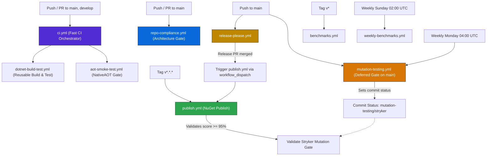

# CI/CD Pipeline & Release Strategy

This document describes the GitHub Actions workflows, build process, release strategy, dependency management, and supply chain security measures for the `EricksonLopez.Result` ecosystem.

---

## 1. Workflows Overview

The repository utilizes **nine automated GitHub Actions workflow files**:

| Workflow | File | Trigger | Purpose |
|---|---|---|---|
| **CI Orchestrator** | `ci.yml` | `push`, `pull_request` on `main`, `develop` | Orchestrates build-test and NativeAOT smoke test pipelines. |
| **Reusable Build & Test** | `dotnet-build-test.yml` | `workflow_call` | Restores, builds Release, executes tests, collects coverage (Coverlet), and runs SonarCloud analysis. |
| **NativeAOT Smoke Test** | `aot-smoke-test.yml` | `workflow_call`, `push`/`pull_request`, manual | Compiles and publishes native binary (`PublishAot=true`), enforcing zero IL trimming/AOT warnings. |
| **Publish NuGet** | `publish.yml` | `push` tag `v*.*.*`, `workflow_dispatch` | Packs all 14 packages, generates Sigstore provenance attestations, and publishes to NuGet.org via OIDC. |
| **Release Please** | `release-please.yml` | `push` to `main` | Analyzes Conventional Commits, generates release PRs, bumps versions, and tags releases. |
| **Mutation Testing** | `mutation-testing.yml` | `push` to `main`, `workflow_dispatch`, weekly cron (`0 4 * * 1`) | Runs Stryker.NET mutation testing asynchronously on `main` as a deferred quality gate (thresholds: high=100, low=98, break=95). |
| **Baseline Benchmarks** | `benchmarks.yml` | `workflow_dispatch`, `push` tag `v*` | Runs BenchmarkDotNet, captures baseline reports, and commits results to repository. |
| **Weekly Deep Benchmarks** | `weekly-benchmarks.yml` | Weekly cron (`0 2 * * 0`), `workflow_dispatch` | Executes deep multi-runtime (.NET 8, 9, 10) performance reviews. |
| **Repository Compliance** | `repo-compliance.yml` | `push`/`pull_request` on `main`, `workflow_dispatch` | Runs `verify-compliance.ps1`, strict build diagnostics, unit tests, and NuGet pack validation as an architecture gate. |

---

## 2. Workflow Interaction Architecture



---

## 3. Build & Test Process

The automated build and test pipeline follows strict quality gates:

```mermaid
flowchart LR
    Checkout[Checkout] --> SDK[Setup .NET 10.0.x]
    SDK --> SNK[Restore SNK Key]
    SNK --> Restore[dotnet restore EricksonLopez.Result.slnx]
    Restore --> Java[Setup Java 17]
    Java --> SonarBegin[Begin Sonar Analysis]
    SonarBegin --> Build[dotnet build Release]
    Build --> Test[dotnet test + Coverlet Coverage]
    Test --> SonarEnd[End Sonar Analysis]
    SonarEnd --> Upload[Upload Test Results TRX]
    Upload --> Codecov[Upload to Codecov]
```



### Secrets Configuration

| Secret | Purpose | Required In |
|---|---|---|
| `SNK_KEY` | Base64-encoded private Strong Name Key (`.snk`) for assembly signing. | `dotnet-build-test.yml`, `publish.yml`, `aot-smoke-test.yml`, `mutation-testing.yml`, `benchmarks.yml`, `weekly-benchmarks.yml` |
| `CODECOV_TOKEN` | Codecov upload token for code coverage tracking. | `dotnet-build-test.yml`, `publish.yml` |
| `SONAR_TOKEN` | SonarCloud token for static code analysis. | `dotnet-build-test.yml` |
| `GITHUB_TOKEN` | Built-in token for GitHub release creation and branch commits. | `release-please.yml`, `publish.yml`, `benchmarks.yml`, `weekly-benchmarks.yml` |

---

## 4. Release Strategy

The ecosystem uses **Release Please** coupled with **Conventional Commits** for automated semantic versioning and release management:

1. **Commit Message Format**:
   - `feat(scope): ...` → **MINOR** version bump (`1.0.0` → `1.1.0`)
   - `fix(scope): ...` → **PATCH** version bump (`1.0.0` → `1.0.1`)
   - `feat!: ...` or `BREAKING CHANGE:` → **MAJOR** version bump (`1.0.0` → `2.0.0`)
   - `docs:`, `chore:`, `refactor:`, `perf:`, `test:` → No version bump
2. **Release PR Creation**: Release Please maintains an active PR that updates `Directory.Build.props` (`VersionPrefix`) and `CHANGELOG.md`.
3. **Merge & Publish Trigger**: When the maintainer merges the Release PR, Release Please creates a GitHub Release and triggers `publish.yml`.

---

## 5. Supply Chain Security

`EricksonLopez.Result` implements industry-standard supply chain security controls:

### Sigstore Provenance Attestation (SLSA v1.0)
All `.nupkg` packages generated by `publish.yml` receive a cryptographically signed provenance attestation via `actions/attest-build-provenance@v2`:
```bash
gh attestation verify <package.nupkg> --repo ericksonlopez/dotnet-result
```

### NuGet Trusted Publishing (OIDC)
Publishing to NuGet.org is executed using OpenID Connect (OIDC) via `NuGet/login@v1`, eliminating long-lived static API keys.

### Strong Name Signing
All distributed assemblies are strong-name signed. The public key is embedded in `Directory.Build.props`, and the private key is securely restored in CI from `SNK_KEY`.

### NuGet Dependency Auditing
All projects have `NuGetAudit=true` and `NuGetAuditLevel=low` enabled in `Directory.Build.props` to block builds with known vulnerabilities in transitive packages.
