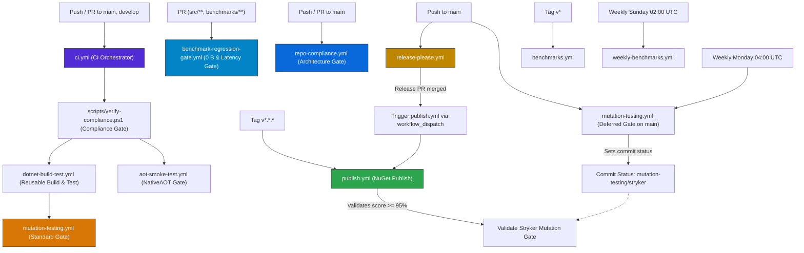

# CI/CD Pipeline & Release Strategy

This document describes the GitHub Actions workflows, build process, release strategy, dependency management, quality gates, and supply chain security measures for the `EricksonLopez.Result` ecosystem.

---

## 1. Workflows Overview

The repository utilizes **ten automated GitHub Actions workflow files**:

| Workflow | File | Trigger | Purpose |
|---|---|---|---|
| **CI Orchestrator** | `ci.yml` | `push`, `pull_request` on `main`, `develop` | Orchestrates compliance gate, reusable build-test, NativeAOT smoke test, and Stryker mutation testing. |
| **Reusable Build & Test** | `dotnet-build-test.yml` | `workflow_call` | Restores, builds Release, executes tests across .NET 8/9/10, collects coverage (Coverlet OpenCover/Cobertura), and runs SonarCloud analysis. |
| **NativeAOT Smoke Test** | `aot-smoke-test.yml` | `workflow_call`, `push`/`pull_request`, manual | Compiles and publishes native binary (`PublishAot=true`), enforcing zero IL trimming/AOT warnings. |
| **Publish NuGet** | `publish.yml` | `push` tag `v*.*.*`, `workflow_dispatch` | Verifies mutation gate, packs packages, generates Sigstore provenance attestations, and publishes to NuGet.org via OIDC. |
| **Release Please** | `release-please.yml` | `push` to `main` | Analyzes Conventional Commits, generates release PRs, bumps versions (`Directory.Build.props`), and tags releases. |
| **Mutation Testing** | `mutation-testing.yml` | `push` to `main`, `workflow_dispatch`, weekly cron (`0 4 * * 1`), `workflow_call` | Runs Stryker.NET mutation testing asynchronously across assemblies as a quality gate (thresholds: high=100, low=98, break=95). |
| **Baseline Benchmarks** | `benchmarks.yml` | `workflow_dispatch`, `push` tag `v*` | Runs BenchmarkDotNet, captures baseline reports, and commits results to the repository. |
| **Weekly Deep Benchmarks** | `weekly-benchmarks.yml` | Weekly cron (`0 2 * * 0`), `workflow_dispatch` | Executes deep multi-runtime (.NET 8, 9, 10) performance benchmark reviews. |
| **Benchmark Regression Gate** | `benchmark-regression-gate.yml` | `pull_request` on `main`, `develop` (`src/**`, `benchmarks/**`), manual | Enforces zero heap allocation (0 B) on hot paths and <= 5% mean latency regression threshold. |
| **Repository Compliance** | `repo-compliance.yml` | `push`/`pull_request` on `main`, `workflow_dispatch` | Runs `verify-compliance.ps1`, strict build diagnostics, unit tests, and solution-wide NuGet pack validation as an architecture gate. |

---

## 2. Workflow Interaction Architecture



---

## 3. Build Process & Pipeline Flow

The automated build and test pipeline enforces strict quality gates:

```mermaid
flowchart LR
    Checkout[Checkout] --> SDK[Setup .NET 8.0, 9.0, 10.0]
    SDK --> SNK[Restore SNK Key]
    SNK --> Restore[dotnet restore EricksonLopez.Result.slnx]
    Restore --> Java[Setup Java 17]
    Java --> SonarBegin[Begin Sonar Analysis]
    SonarBegin --> Build[dotnet build Release]
    Build --> Test[dotnet test + Coverlet Coverage]
    Test --> SonarEnd[End Sonar Analysis]
    SonarEnd --> Upload[Upload Test Results TRX]
    Upload --> Codecov[Upload to Codecov]
```



### Build & Release Lifecycle Stages
1. **Restore**: Uses `dotnet restore EricksonLopez.Result.slnx` with Central Package Management (`Directory.Packages.props`).
2. **Build**: `dotnet build EricksonLopez.Result.slnx --configuration Release` with strict warnings as errors (`TreatWarningsAsErrors=true`).
3. **Test**: `dotnet test` with Coverlet collector outputting both `opencover` and `cobertura` formats.
4. **Pack**: `dotnet pack` generates `.nupkg` and `.snupkg` symbol packages with deterministic source links and strong-name signed binaries.
5. **Publish**: Verifies mutation gate score ($\ge 95\%$), signs provenance via Sigstore, and pushes to NuGet.org via OIDC.

---

## 4. Quality Gates & Governance

### 4.1 Architecture & Compliance Gate (`scripts/verify-compliance.ps1`)
Runs before build jobs to enforce repository-wide architectural rules:
- **Gate 1**: Clean Architecture rule verification (no forbidden references).
- **Gate 2**: Zero `[Obsolete]` attributes in production code (subject to strict governance).
- **Gate 3**: Zero public mutable fields or properties on `Result` structs.
- **Gate 4**: XML documentation completeness on all public symbols.

### 4.2 Code Coverage (Coverlet & Codecov)
- **Engine**: Coverlet XPlat Code Coverage integrated into test execution.
- **Formats**: OpenCover (`coverage.opencover.xml`) for SonarCloud, Cobertura (`coverage.cobertura.xml`) for Codecov.
- **Configuration**: Exclusions configured for test suites, benchmarks, samples, and generated code in SonarCloud and `.codecov.yml`.

### 4.3 Mutation Testing (Stryker.NET)
- **Orchestration**: `mutation-testing.yml` with 20 project-specific Stryker configuration files.
- **Thresholds**: High: `100%`, Low: `98%`, Break: `95%`.
- **Enforcement**: Blocks NuGet publishing if mutation score is below 95%.

### 4.4 Static Analysis (SonarCloud)
- **Scanner**: `dotnet-sonarscanner` running under Java 17 Zulu.
- **Scope**: Production code in `src/`. Exclusions for samples, benchmarks, test suites, and repetitive pattern combinators (`Result.Combine.cs`, `Result.ValidateAll.cs`).

### 4.5 Dependency Scanning (Dependabot)
- **NuGet Ecosystem**: Weekly check on Mondays at 09:00 America/New_York targeting `develop`. Limit: 10 PRs.
  - Grouped PRs: `microsoft-extensions`, `system-libs`, `fluentvalidation`, `mediatr`, `opentelemetry`, `xunit`, `stryker`, `roslyn`.
- **GitHub Actions Ecosystem**: Monthly check on Mondays at 09:00 America/New_York targeting `develop`. Limit: 5 PRs.

---

## 5. Secrets Configuration

| Secret | Purpose | Required In |
|---|---|---|
| `SNK_KEY` | Base64-encoded private Strong Name Key (`.snk`) for assembly signing. | `ci.yml`, `dotnet-build-test.yml`, `publish.yml`, `aot-smoke-test.yml`, `mutation-testing.yml`, `benchmarks.yml`, `weekly-benchmarks.yml`, `benchmark-regression-gate.yml` |
| `CODECOV_TOKEN` | Codecov upload token for code coverage reporting. | `ci.yml`, `dotnet-build-test.yml`, `publish.yml` |
| `SONAR_TOKEN` | SonarCloud token for static code analysis. | `ci.yml`, `dotnet-build-test.yml` |
| `GITHUB_TOKEN` | Built-in token for GitHub release creation, PR management, and branch commits. | `release-please.yml`, `publish.yml`, `benchmarks.yml`, `weekly-benchmarks.yml` |

---

## 6. Branch Strategy

The repository follows a GitHub Flow branching model observed in CI triggers:
- **`main`**: Production-ready branch. Receives merged release PRs and trigger points for releases, deep mutation analysis, and compliance gates.
- **`develop`**: Active integration branch. Receives feature PRs, Dependabot dependency bumps, and runs standard CI.
- **`v*.*.*` tags**: Immutable release tags created automatically by Release Please upon merging release PRs to `main`.

---

## 7. Release Strategy

The ecosystem uses **Release Please** coupled with **Conventional Commits** for automated semantic versioning:

1. **Commit Message Conventions**:
   - `feat(scope): ...` → **MINOR** version bump (`3.0.0` → `3.1.0`)
   - `fix(scope): ...` → **PATCH** version bump (`3.0.0` → `3.0.1`)
   - `feat!: ...` or `BREAKING CHANGE:` → **MAJOR** version bump (`3.0.0` → `4.0.0`)
   - `docs:`, `chore:`, `refactor:`, `perf:`, `test:` → No version bump
2. **Release PR Creation**: Release Please maintains an active PR that updates `Directory.Build.props` (`VersionPrefix`) and `CHANGELOG.md`.
3. **Merge & Publish Trigger**: When the maintainer merges the Release PR, Release Please tags the release and triggers `publish.yml` via `workflow_dispatch`.

> [!NOTE]
> **Package Packaging Scope in CI/CD**:
> Both solution-wide commands (`dotnet pack EricksonLopez.Result.slnx` as run in `repo-compliance.yml`) and `.github/workflows/publish.yml` explicitly pack all **20 packable projects** in lockstep, verifying mutation quality gates, generating SLSA v1.0 Sigstore provenance attestations, and publishing via NuGet Trusted Publishing (OIDC).

---

## 8. Supply Chain Security

`EricksonLopez.Result` implements multi-layer supply chain security controls:

### Sigstore Provenance Attestation (SLSA v1.0)
All `.nupkg` packages generated by `publish.yml` receive a cryptographically signed provenance attestation via `actions/attest-build-provenance@v2`:
```bash
gh attestation verify <package.nupkg> --repo ericksonlopezf/dotnet-result
```

### NuGet Trusted Publishing (OIDC)
Publishing to NuGet.org is executed using OpenID Connect (OIDC) via `NuGet/login@v1`, eliminating long-lived static API keys.

### Strong Name Signing
All distributed assemblies are strong-name signed. The public key is embedded in `Directory.Build.props`, and the private key is securely restored in CI from `SNK_KEY`.

### NuGet Dependency Auditing
All projects have `NuGetAudit=true` and `NuGetAuditLevel=low` enabled in `Directory.Build.props` to block builds with known vulnerabilities in transitive packages.
