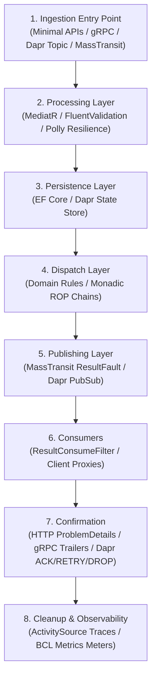
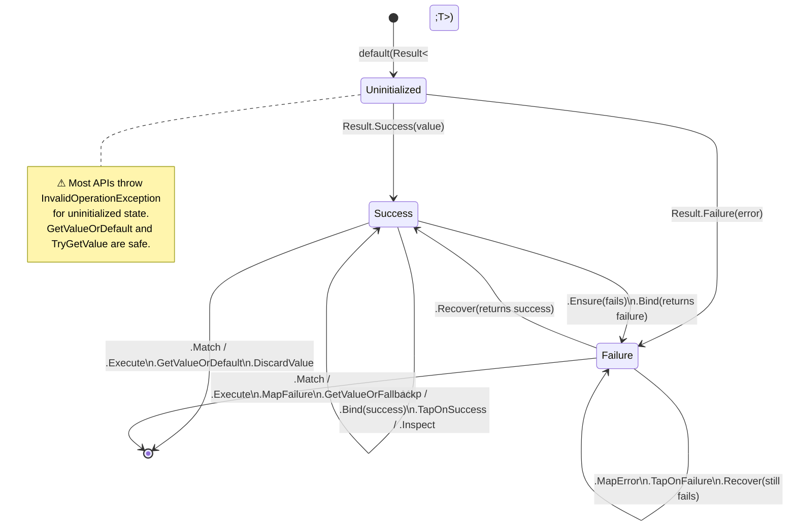
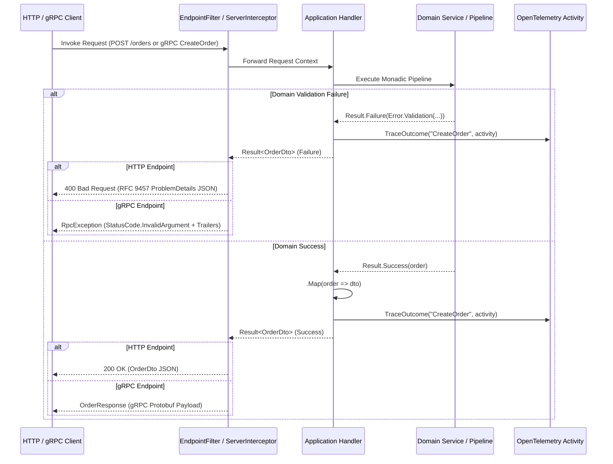
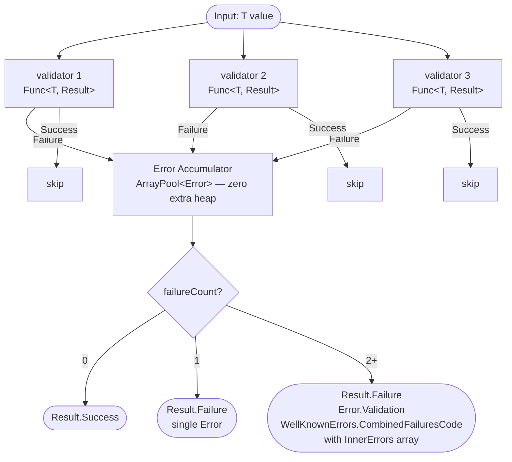
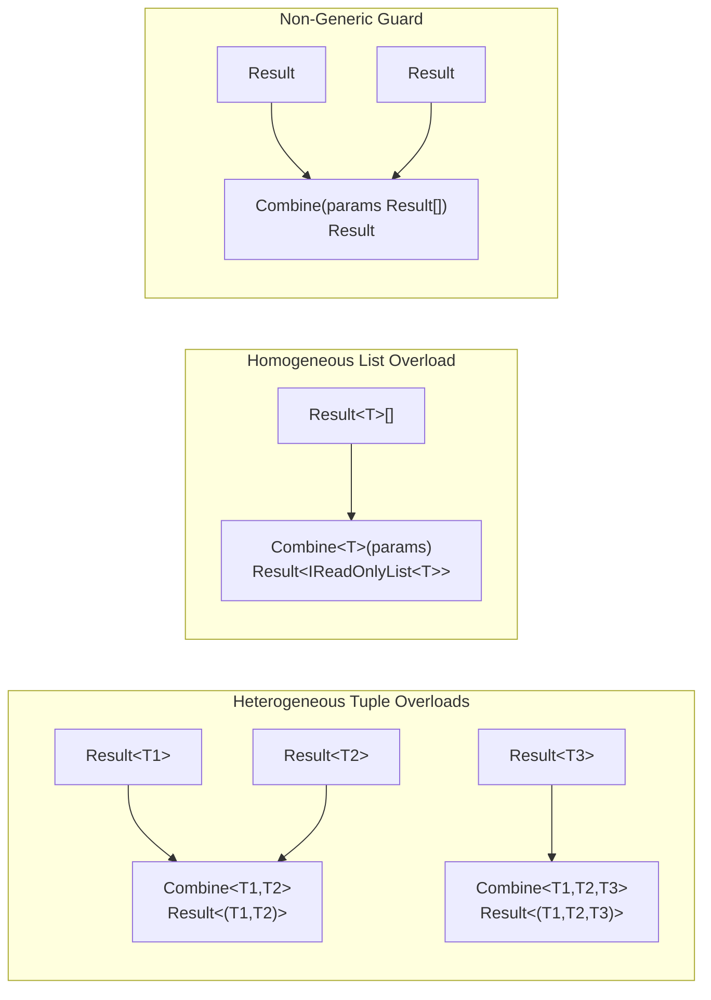
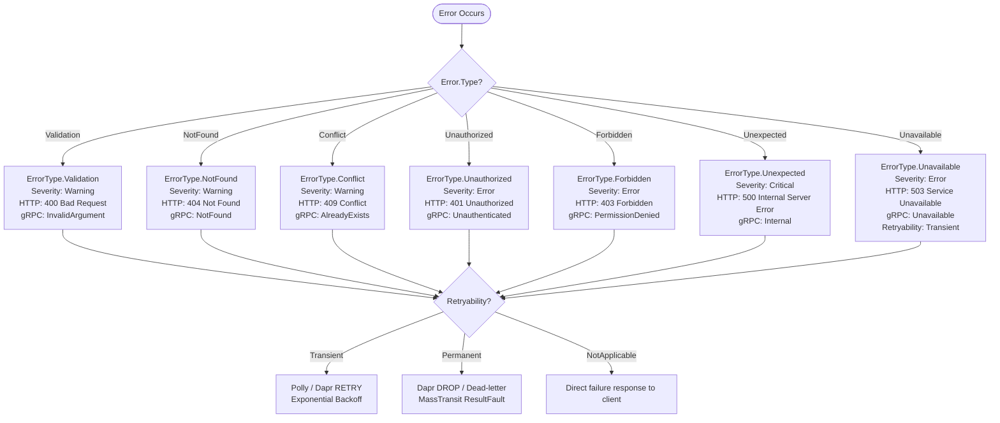

# Functional Map & Architecture Flow
**EricksonLopez.Result** — Component interaction from input to output across the complete ecosystem

---

## 1. General Architecture Diagram

```mermaid
graph TB
    subgraph "Client Layer"
        Client([HTTP Client / gRPC Client / Message Broker / Dapr Sidecar / Test Suite])
    end

    subgraph "API & Ingestion Layer"
        Filter[ResultEndpointFilter\nUnwrap Result → IResult]
        HttpExt[.ToHttpResult\nRFC 9457 ProblemDetails]
        HttpOpts[ResultHttpOptions\nErrorType → HTTP Status]
        OpenApiDocs[ResultOpenApiExtensions\nProducesResult / ProducesProblemDetails]
        GrpcService[gRPC Service\nResultServerInterceptor]
        DaprPubSub[Dapr Pub/Sub Handler\nToDaprTopicResult]
    end

    subgraph "Application Layer — MediatR & FluentValidation"
        Handler[Application Handler\nCommand / Query]
        MediatRBehavior[ResultExceptionBehavior\nException → Result.Failure]
        FVExt[FluentValidation.ToValidationResult\nValidationResult → Result]
    end

    subgraph "Resilience Layer — Polly"
        PollyPipe[ResiliencePipeline\nExecuteResult / ExecuteResultAsync]
        PollyRetry[AddResultRetry\nRetry on ErrorRetryability.Transient]
    end

    subgraph "Domain Layer — Core, Generic & Maybe"
        ResultCore["Result / Result&lt;T&gt;\n(readonly struct — zero heap)"]
        ResultGeneric["Result&lt;TValue, TError&gt;\n(strongly-typed error)"]
        MaybeCore["Maybe&lt;T&gt;\n(Some / None optionality)"]
        ErrorCore["Error\n(sealed class — structured diagnostic)"]
        ErrorBuilder["ErrorBuilder\n(fluent copy-on-write builder)"]
        WellKnown["WellKnownErrors\n(sentinel constants)"]
        GeneratedErrors["DomainErrors.Generators\n(Compile-time static error catalogs)"]
    end

    subgraph "Composition Layer"
        Combine[Result.Combine\nAggregate N results / Tuples]
        ValidateAll[Result.ValidateAll\nAccumulate failures zero-alloc]
        Merge[Result.Merge\nGuard + typed passthrough]
        LINQ[ResultLinqExtensions\nfrom x in result select ...]
        SyncExt[ResultSyncExtensions\nin-param, zero-copy TState]
        AsyncExt[ResultExtensions\nTask/ValueTask pipelines]
    end

    subgraph "Persistence Layer — EntityFrameworkCore & Dapr State"
        EFQueries[FirstOrDefaultToResultAsync\nSingleOrDefaultToResultAsync / ToListToResultAsync]
        EFSave[SaveChangesAsyncToResult\nDbUpdateConcurrencyException → Conflict]
        DaprState[DaprClient.GetStateWithResultAsync\nSaveStateWithResultAsync / ETag Mismatch → Conflict]
    end

    subgraph "Messaging Layer — MassTransit & Dapr Pub/Sub"
        MTFault[ResultFault\nDistributed Error DTO Contract]
        MTFilter[ResultConsumeFilter\nConsume pipe coordination]
        DaprResponse[DaprErrorResponse\nACK / RETRY 503 / DROP 422]
    end

    subgraph "Observability — OpenTelemetry"
        TraceOutcome[ResultActivityExtensions.TraceOutcome\nAnnotate Activity.Current]
        Metrics[ResultMetrics\nDI + static BCL meters]
    end

    subgraph "Serialization Layer — System.Text.Json & Generators"
        JsonConverter[ResultJsonConverter / ResultOfTJsonConverter\nNative AOT Contexts]
        JsonAot[ResultJsonSerializerContext\nSource Generator]
    end

    subgraph "Testing Layer — Testing, NUnit & XUnit"
        Assertions[ResultAssertions\n.ShouldBeSuccess / .ShouldBeFailure]
        NUnitAdapter[ResultNUnitAssertionConfig\nAssertionException adapter]
        XUnitAdapter[ResultXUnitAssertionConfig\nXunitException adapter]
    end

    Client --> Filter
    Client --> GrpcService
    Client --> DaprPubSub
    Filter --> HttpExt
    Filter --> HttpOpts
    Filter --> OpenApiDocs
    Filter --> Handler
    GrpcService --> Handler
    DaprPubSub --> Handler
    Handler --> MediatRBehavior
    Handler --> FVExt
    Handler --> PollyPipe
    PollyPipe --> PollyRetry
    PollyPipe --> ResultCore
    Handler --> ResultCore
    ResultCore --> ErrorCore
    ResultCore --> Combine
    ResultCore --> ValidateAll
    ResultCore --> Merge
    ResultCore --> LINQ
    ResultCore --> SyncExt
    ResultCore --> AsyncExt
    ResultCore --> ResultGeneric
    ResultCore --> MaybeCore
    GeneratedErrors --> ErrorCore
    ErrorCore --> ErrorBuilder
    ErrorCore --> WellKnown
    Handler --> EFQueries
    Handler --> EFSave
    Handler --> DaprState
    Handler --> MTFilter
    MTFilter --> MTFault
    DaprPubSub --> DaprResponse
    ResultCore --> TraceOutcome
    ResultCore --> Metrics
    ResultCore --> JsonConverter
    JsonConverter --> JsonAot
    ResultCore --> Assertions
    Assertions --> NUnitAdapter
    Assertions --> XUnitAdapter
```

---

## 2. End-to-End Functional Lifecycle (8 Stages)

The system processes outcomes through eight well-defined architectural phases:

### Detailed Layer Transitions:

1. **Ingestion Entry Point (Application Ingestion)**:
   - **HTTP Minimal APIs**: Requests arrive at endpoint handlers configured with `.AddResultEndpointFilter()` or manual `.ToHttpResult()`.
   - **gRPC**: Calls enter through `ResultServerInterceptor`, which monitors the invocation lifecycle.
   - **Dapr Pub/Sub**: Incoming CloudEvents are received on endpoints configured with `.ToDaprTopicResult()`.
   - **MassTransit**: Messages enter the consumer pipeline wrapped with `ResultConsumeFilter<TMessage>`.

2. **Processing Layer (Validation & CQRS Pipeline)**:
   - MediatR executes `ResultExceptionBehavior<TRequest, TResponse>`, shielding downstream handlers from unhandled exceptions.
   - FluentValidation checks command payloads using `ValidateToResult` or `EnsureValidAsync`, aggregating property validation failures into a structured `Error.Validation`.
   - Polly resilience pipelines (`ExecuteResultAsync`) apply `AddResultRetry`, retrying exclusively when `Error.Retryability == Transient`.

3. **Persistence Layer (Resilient Data Access)**:
   - Entity Framework Core executes `FirstOrDefaultToResultAsync` or `SingleOrDefaultToResultAsync`, gracefully translating entity absence into a domain `Error.NotFound` without null ambiguity.
   - Database writes run via `SaveChangesAsyncToResult`, mapping `DbUpdateConcurrencyException` to `ErrorType.Conflict` with `EntityFrameworkErrorCodes.ConcurrencyConflict`.
   - Dapr state operations (`GetStateWithResultAsync`, `SaveStateWithResultAsync`) handle ETag verification, converting version mismatches to `DaprErrorCodes.EtagMismatch`.

4. **Dispatch Layer (Monadic Domain Dispatch)**:
   - Domain logic executes using zero-allocation `Result<T>` and `ResultSyncExtensions` with `TState` state-passing.
   - Guard conditions are asserted via `.Ensure()`. Intermediate workflows are chained via `.Bind()`.
   - Multiple parallel results are combined atomically using `Result.Combine(...)` or accumulated via `Result.ValidateAll(...)`.

5. **Publishing Layer (Event & Fault Dispatch)**:
   - When a domain failure occurs in an asynchronous bus workflow, the error is mapped to a `ResultFault` message contract containing code, description, type, severity, retryability, correlationId, and traceId.
   - Published onto RabbitMQ, Azure Service Bus, or Kafka via MassTransit or emitted to Dapr Pub/Sub.

6. **Consumers (Consumer Interception & Translation)**:
   - Downstream consumers evaluate incoming faults.
   - `ResultConsumeFilter<TMessage>` catches unhandled failures, responds with `ResultFault`, and avoids unhandled deadlocks in the transport layer.

7. **Confirmation (Outcome Confirmation & Status Mapping)**:
   - **HTTP**: `ResultHttpExtensions.ToHttpResult()` maps `ErrorType` to standard HTTP status codes (400, 404, 409, 503) and formats an RFC 9457 ProblemDetails JSON body.
   - **gRPC**: `GrpcErrorMapper` translates `ErrorType` to gRPC `StatusCode` and serializes error metadata into gRPC trailers (`error-code`, `error-type`, `error-meta`).
   - **Dapr**: `ToDaprTopicResult()` returns `200 OK` (ACK), `503 Service Unavailable` (RETRY for transient errors), or `422 Unprocessable Entity` (DROP for permanent failures).

8. **Cleanup & Observability (Telemetry & Resource Reclamation)**:
   - The result is recorded onto the ambient `Activity.Current` via `.TraceOutcome(...)`, setting W3C span status and tags.
   - Metrics counters (`ericksonlopez.result.success.count`, `ericksonlopez.result.failure.count`) are updated via `ResultMetrics`.
   - Heap allocations are kept at zero for successful paths through struct-based monads and stack-frame passing.

---

## 3. Primary Flow: Railway-Oriented Pipeline

---

## 4. Result&lt;T&gt; State Diagram

---

## 5. Sequence Diagram: ASP.NET Core & gRPC Request Lifecycle

---

## 6. Complete Package Dependencies Diagram

```mermaid
graph TD
    Core["EricksonLopez.Result\n(Core — Zero external dependencies)"]
    Generic["EricksonLopez.Result.Generic\n(Typed Error Monad)"]
    Maybe["EricksonLopez.Result.Maybe\n(Option Monad)"]
    
    AspNetCore["EricksonLopez.Result.AspNetCore\n(Microsoft.AspNetCore.Http)"]
    EFCore["EricksonLopez.Result.EntityFrameworkCore\n(Microsoft.EntityFrameworkCore)"]
    FluentVal["EricksonLopez.Result.FluentValidation\n(FluentValidation)"]
    MassTransit["EricksonLopez.Result.MassTransit\n(MassTransit.Abstractions)"]
    MediatR["EricksonLopez.Result.MediatR\n(MediatR)"]
    OpenApi["EricksonLopez.Result.OpenApi\n(Microsoft.AspNetCore.OpenApi)"]
    OpenTelemetry["EricksonLopez.Result.OpenTelemetry\n(System.Diagnostics — BCL only)"]
    Polly["EricksonLopez.Result.Polly\n(Polly.Core)"]
    Serialization["EricksonLopez.Result.Serialization\n(System.Text.Json — BCL only)"]
    Dapr["EricksonLopez.Result.Dapr\n(Dapr.Client)"]
    Grpc["EricksonLopez.Result.Grpc\n(Grpc.AspNetCore.Server, Grpc.Core.Api)"]
    Testing["EricksonLopez.Result.Testing\n(Framework-agnostic assertions)"]
    NUnit["EricksonLopez.Result.Testing.NUnit\n(NUnit adapter)"]
    XUnit["EricksonLopez.Result.Testing.XUnit\n(xUnit adapter)"]
    Analyzers["EricksonLopez.Result.Analyzers\n(Roslyn SDK — build-time only)"]
    DomainErrors["EricksonLopez.Result.DomainErrors.Generators\n(Roslyn SDK — build-time only)"]
    SerGen["EricksonLopez.Result.Serialization.Generators\n(Roslyn SDK — build-time only)"]

    Core --> Generic
    Core --> Maybe
    Core --> AspNetCore
    Core --> EFCore
    Core --> FluentVal
    Core --> MassTransit
    Core --> MediatR
    Core --> OpenApi
    Core --> OpenTelemetry
    Core --> Polly
    Core --> Serialization
    Core --> Dapr
    Core --> Grpc
    Core --> Testing
    Testing --> NUnit
    Testing --> XUnit
    Core -.->|build-time analyzer| Analyzers
    Core -.->|build-time generator| DomainErrors
    Serialization -.->|build-time generator| SerGen
```

---

## 7. ValidateAll Pipeline Diagram (Zero-Alloc Accumulation)

---

## 8. Combine Monadic Matrix Diagram

---

## 9. Resilient Error Handling & Retry Routing Flow

