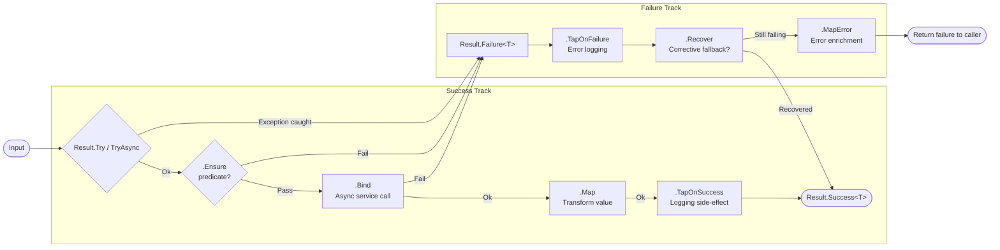
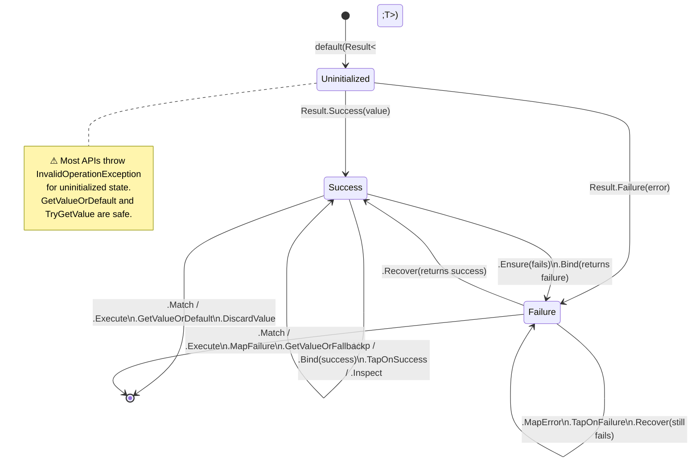
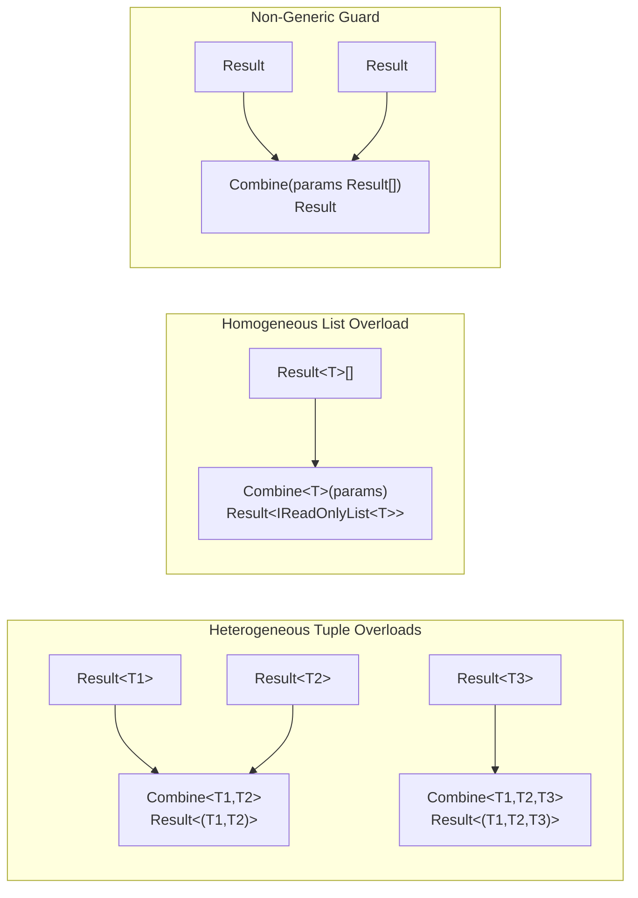
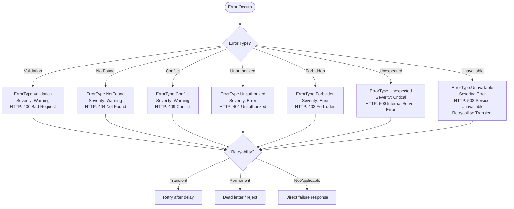

# Phase 2 — Complete Functional Map
**EricksonLopez.Result** — Component interaction from input to output

---

## 1. General Architecture Diagram

```mermaid
graph TB
    subgraph "Client Layer"
        Client([HTTP Client / Test / Consumer])
    end

    subgraph "API Layer — EricksonLopez.Result.AspNetCore"
        Filter[ResultEndpointFilter\nUnwrap Result → IResult]
        HttpExt[.ToHttpResult\nRFC 9457 ProblemDetails]
        HttpOpts[ResultHttpOptions\nErrorType → HTTP Status]
    end

    subgraph "Application Layer"
        Handler[Application Handler\nCommand / Query]
        MediatRBehavior[ResultExceptionBehavior\nException → Result.Failure]
        FVExt[FluentValidation.ToValidationResult\nValidationResult → Result]
    end

    subgraph "Domain Layer"
        ResultCore["Result / Result&lt;T&gt;\n(readonly struct — zero heap)"]
        ErrorCore["Error\n(sealed class — structured diagnostic)"]
        ErrorBuilder["ErrorBuilder\n(readonly struct — fluent copy-on-write)"]
        WellKnown["WellKnownErrors\n(sentinel constants)"]
    end

    subgraph "Composition Layer"
        Combine[Result.Combine\nAggregate N results]
        ValidateAll[Result.ValidateAll\nAccumulate failures]
        Merge[Result.Merge\nGuard + typed passthrough]
        LINQ[ResultLinqExtensions\nfrom x in result select ...]
        SyncExt[ResultSyncExtensions\nin-param, zero-copy]
        AsyncExt[ResultExtensions\nTask/ValueTask pipelines]
    end

    subgraph "Observability — EricksonLopez.Result.OpenTelemetry"
        TraceOutcome[ResultActivityExtensions.TraceOutcome\nAnnotate Activity.Current]
        Metrics[ResultMetrics\nDI + static counters]
    end

    subgraph "Serialization — EricksonLopez.Result.Serialization"
        JsonConverter[ResultJsonConverter&lt;T&gt;\nSystem.Text.Json integration]
    end

    subgraph "Testing — EricksonLopez.Result.Testing"
        Assertions[ResultAssertions\n.ShouldBeSuccess / .ShouldBeFailure]
    end

    Client --> Filter
    Filter --> HttpExt
    Filter --> HttpOpts
    Filter --> Handler
    Handler --> MediatRBehavior
    Handler --> FVExt
    Handler --> ResultCore
    ResultCore --> ErrorCore
    ResultCore --> Combine
    ResultCore --> ValidateAll
    ResultCore --> Merge
    ResultCore --> LINQ
    ResultCore --> SyncExt
    ResultCore --> AsyncExt
    ErrorCore --> ErrorBuilder
    ErrorCore --> WellKnown
    ResultCore --> TraceOutcome
    ResultCore --> Metrics
    ResultCore --> JsonConverter
    ResultCore --> Assertions
```



---

## 2. Primary Flow: Railway-Oriented Pipeline



---

## 3. Result&lt;T&gt; State Diagram



---

## 4. Sequence Diagram: ASP.NET Core Request → Result → HTTP Response

```mermaid
sequenceDiagram
    participant Client as HTTP Client
    participant Filter as ResultEndpointFilter
    participant Handler as Minimal API Handler
    participant Domain as Domain / Application Service
    participant OTel as OpenTelemetry Activity

    Client->>Filter: POST /orders {payload}
    Filter->>Handler: Invoke(context)
    Handler->>Domain: CreateOrderAsync(command)
    
    alt Domain validates input
        Domain-->>Handler: Result.Failure(Error.Validation(...))
        Handler-->>Filter: Result&lt;OrderDto&gt; (failure)
        Filter->>Filter: ToHttpResult() → 400 ProblemDetails
        Filter-->>Client: 400 Bad Request (RFC 9457 JSON)
    else Domain succeeds
        Domain-->>Handler: Result.Success(order)
        Handler->>Handler: .Map(order => dto)
        Handler->>OTel: TraceOutcome("CreateOrder", activity)
        Handler-->>Filter: Result&lt;OrderDto&gt; (success)
        Filter->>Filter: ToHttpResult() → 200 OK
        Filter-->>Client: 200 OK (OrderDto JSON)
    end
```

---

## 5. Package Dependencies Diagram

```mermaid
graph TD
    Core["EricksonLopez.Result\n(Core — no external deps)"]
    
    AspNetCore["EricksonLopez.Result.AspNetCore\n(Microsoft.AspNetCore.Http)"]
    FluentVal["EricksonLopez.Result.FluentValidation\n(FluentValidation)"]
    MediatR["EricksonLopez.Result.MediatR\n(MediatR)"]
    OpenApi["EricksonLopez.Result.OpenApi\n(Microsoft.AspNetCore.OpenApi)"]
    OpenTelemetry["EricksonLopez.Result.OpenTelemetry\n(System.Diagnostics — BCL only)"]
    Serialization["EricksonLopez.Result.Serialization\n(System.Text.Json — BCL only)"]
    Testing["EricksonLopez.Result.Testing\n(no assertion framework dep)"]
    Analyzers["EricksonLopez.Result.Analyzers\n(Roslyn SDK — build-time only)"]

    Core --> AspNetCore
    Core --> FluentVal
    Core --> MediatR
    Core --> OpenApi
    Core --> OpenTelemetry
    Core --> Serialization
    Core --> Testing
    Core -.->|build-time only| Analyzers
```



---

## 6. ValidateAll Pipeline Diagram (Error Accumulation)


---

## 7. Combine Diagram — Heterogeneous vs Homogeneous



---

## 8. Error Handling Flow Diagram


