# Package Reference

Comprehensive reference for all NuGet packages in the `EricksonLopez.Result` ecosystem, including target frameworks, dependencies, AOT compatibility, and package relationships.

---

## 1. Packages Overview

The ecosystem ships **20 NuGet packages**, all versioned in lockstep from a single `VersionPrefix` in `Directory.Build.props`.

| Package | Type | Target Frameworks | AOT | Trimmable | Strong Named |
|---|---|---|---|---|---|
| `EricksonLopez.Result` | Core library | `net8.0; net9.0; net10.0` | ✅ Yes | ✅ Yes | ✅ Yes |
| `EricksonLopez.Result.Generic` | Typed Error library | `net8.0; net9.0; net10.0` | ✅ Yes | ✅ Yes | ✅ Yes |
| `EricksonLopez.Result.Maybe` | Option type library | `net8.0; net9.0; net10.0` | ✅ Yes | ✅ Yes | ✅ Yes |
| `EricksonLopez.Result.AspNetCore` | Web integration | `net8.0; net9.0; net10.0` | ✅ Yes | ✅ Yes | ✅ Yes |
| `EricksonLopez.Result.OpenApi` | OpenAPI metadata | `net8.0; net9.0; net10.0` | ✅ Yes | ✅ Yes | ✅ Yes |
| `EricksonLopez.Result.FluentValidation` | Validation integration | `net8.0; net9.0; net10.0` | ✅ Yes | ✅ Yes | ✅ Yes |
| `EricksonLopez.Result.MediatR` | Pipeline behavior | `net8.0; net9.0; net10.0` | ❌ No | ❌ No | ✅ Yes |
| `EricksonLopez.Result.OpenTelemetry` | Observability | `net8.0; net9.0; net10.0` | ✅ Yes | ✅ Yes | ✅ Yes |
| `EricksonLopez.Result.Serialization` | JSON converters | `net8.0; net9.0; net10.0` | ⚠️ Partial | ⚠️ Partial | ✅ Yes |
| `EricksonLopez.Result.Serialization.Generators` | Source generator | `netstandard2.0` | ✅ Yes | ✅ Yes | ✅ Yes |
| `EricksonLopez.Result.DomainErrors.Generators` | Source generator | `netstandard2.0` | ✅ Yes | ✅ Yes | ✅ Yes |
| `EricksonLopez.Result.EntityFrameworkCore` | ORM persistence | `net8.0; net9.0; net10.0` | ✅ Yes | ✅ Yes | ✅ Yes |
| `EricksonLopez.Result.Polly` | Resilience pipelines | `net8.0; net9.0; net10.0` | ✅ Yes | ✅ Yes | ✅ Yes |
| `EricksonLopez.Result.MassTransit` | Messaging & events | `net8.0; net9.0; net10.0` | ❌ No | ❌ No | ✅ Yes |
| `EricksonLopez.Result.Dapr` | Distributed state & pub/sub | `net8.0; net9.0; net10.0` | ✅ Yes | ✅ Yes | ✅ Yes |
| `EricksonLopez.Result.Grpc` | gRPC integration | `net8.0; net9.0; net10.0` | ✅ Yes | ✅ Yes | ✅ Yes |
| `EricksonLopez.Result.Analyzers` | Roslyn analyzer | `netstandard2.0` | N/A | N/A | ✅ Yes |
| `EricksonLopez.Result.Testing` | Test assertions | `net8.0; net9.0; net10.0` | ✅ Yes | ✅ Yes | ✅ Yes |
| `EricksonLopez.Result.Testing.XUnit` | xUnit test helpers | `net8.0; net9.0; net10.0` | ❌ No | ❌ No | ✅ Yes |
| `EricksonLopez.Result.Testing.NUnit` | NUnit test helpers | `net8.0; net9.0; net10.0` | ❌ No | ❌ No | ✅ Yes |

---

## 2. Dependency Graph

```mermaid
graph TD
    Core["EricksonLopez.Result<br/>(net8.0 / net9.0 / net10.0)"]
    Analyzers["Analyzers<br/>(netstandard2.0)"]
    Generic["Generic"]
    Maybe["Maybe"]
    AspNetCore["AspNetCore"]
    OpenApi["OpenApi"]
    OTel["OpenTelemetry"]
    Serialization["Serialization"]
    Generators["Serialization.Generators<br/>(netstandard2.0)"]
    Testing["Testing"]
    TestingXUnit["Testing.XUnit"]
    TestingNUnit["Testing.NUnit"]
    FluentVal["FluentValidation"]
    MediatR["MediatR"]
    EFCore["EntityFrameworkCore"]
    Polly["Polly"]
    MassTransit["MassTransit"]
    Dapr["Dapr"]
    Grpc["Grpc"]
    DomainErrors["DomainErrors.Generators<br/>(netstandard2.0)"]

    Core -->|Bundled Analyzer| Analyzers
    Generic -->|ProjectReference| Core
    Maybe -->|ProjectReference| Core
    AspNetCore -->|ProjectReference| Core
    OpenApi -->|ProjectReference| Core
    OTel -->|ProjectReference| Core
    OTel -->|ProjectReference| Generators
    Serialization -->|ProjectReference| Core
    Serialization -->|Bundled Generator| Generators
    Testing -->|ProjectReference| Core
    TestingXUnit -->|ProjectReference| Testing
    TestingNUnit -->|ProjectReference| Testing
    FluentVal -->|ProjectReference| Core
    MediatR -->|ProjectReference| Core
    EFCore -->|ProjectReference| Core
    EFCore -->|ProjectReference| Maybe
    Polly -->|ProjectReference| Core
    MassTransit -->|ProjectReference| Core
    Dapr -->|ProjectReference| Core
    Grpc -->|ProjectReference| Core

    %% External dependencies
    AspNetCore -.->|FrameworkReference| AspNetApp["Microsoft.AspNetCore.App"]
    OpenApi -.->|PackageReference| OApiPkg["Microsoft.AspNetCore.OpenApi 10.0.11"]
    OTel -.->|PackageReference| DIAbstractions["Microsoft.Extensions.DependencyInjection.Abstractions 10.0.12"]
    FluentVal -.->|PackageReference| FV["FluentValidation 12.1.1"]
    MediatR -.->|PackageReference| MR["MediatR 14.2.0"]
    Dapr -.->|PackageReference| DClient["Dapr.Client 1.18.5"]
    Grpc -.->|PackageReference| GrpcApi["Grpc.Core.Api 2.83.0"]
    TestingXUnit -.->|PackageReference| XUAssert["xunit.v3.assert 4.0.0"]
    TestingNUnit -.->|PackageReference| NU["NUnit 4.6.1"]
    Analyzers -.->|PackageReference| Roslyn["Microsoft.CodeAnalysis.CSharp 5.9.0"]

    style Core fill:#512BD4,stroke:#333,color:#fff
    style Analyzers fill:#E8DAEF,stroke:#333
    style Generators fill:#E8DAEF,stroke:#333
    style DomainErrors fill:#E8DAEF,stroke:#333
```

---

## 3. Per-Package Specifications

### 1. `EricksonLopez.Result` (Core)
- **Summary**: Core struct-based `Result` and `Result<TValue>`, `Error` class, `ErrorBuilder`, monadic combinators, cumulative `ValidateAll`, LINQ extensions, and bundled Roslyn analyzers.
- **Target Frameworks**: `net8.0; net9.0; net10.0`
- **AOT / Trimming**: 100% Compatible (zero reflection in hot paths).
- **Public API Exports**: `Result`, `Result<TValue>`, `Error`, `ErrorBuilder`, `ErrorType`, `ErrorSeverity`, `ErrorRetryability`, `IResultOutcome`, `ResultSyncExtensions`, `ResultExtensions`, `ResultLinqExtensions`.

### 2. `EricksonLopez.Result.Generic`
- **Summary**: Provides `Result<TValue, TError>` for strict DDD domain pipelines requiring strongly-typed compile-time error classes.
- **Target Frameworks**: `net8.0; net9.0; net10.0`
- **Dependencies**: `EricksonLopez.Result`

### 3. `EricksonLopez.Result.Maybe`
- **Summary**: Provides struct-based `Maybe<T>` option type with functional combinators (`Map`, `Bind`, `Match`) and seamless bidirectional conversion to `Result<T>`.
- **Target Frameworks**: `net8.0; net9.0; net10.0`
- **Dependencies**: `EricksonLopez.Result`

### 4. `EricksonLopez.Result.AspNetCore`
- **Summary**: ASP.NET Core Minimal APIs filter, `ToHttpResult()` extension, and RFC 9457 ProblemDetails response mapping.
- **Target Frameworks**: `net8.0; net9.0; net10.0`
- **Framework Reference**: `Microsoft.AspNetCore.App`
- **Dependencies**: `EricksonLopez.Result`

### 5. `EricksonLopez.Result.OpenApi`
- **Summary**: OpenAPI schema transformer and metadata extension (`ProducesResult<T>()`, `ProducesResultProblemDetails()`) for Minimal API endpoint documentation.
- **Target Frameworks**: `net8.0; net9.0; net10.0`
- **Dependencies**: `EricksonLopez.Result`, `Microsoft.AspNetCore.OpenApi`

### 6. `EricksonLopez.Result.FluentValidation`
- **Summary**: Converts FluentValidation `ValidationResult` to `Result` and `Error` failure representations with automatic property name and attempted value metadata.
- **Target Frameworks**: `net8.0; net9.0; net10.0`
- **Dependencies**: `EricksonLopez.Result`, `FluentValidation`

### 7. `EricksonLopez.Result.MediatR`
- **Summary**: Pipeline behavior (`ResultExceptionBehavior`) that intercepts unhandled exceptions and wraps them into `Result` failure responses.
- **Target Frameworks**: `net8.0; net9.0; net10.0`
- **AOT Note**: ❌ Not AOT compatible (MediatR uses dynamic runtime reflection; see ADR-018 for deprecation roadmap).
- **Dependencies**: `EricksonLopez.Result`, `MediatR`

### 8. `EricksonLopez.Result.OpenTelemetry`
- **Summary**: OpenTelemetry `ActivitySource` tracing integration (`TraceOutcome()`) and BCL runtime metrics (`ResultMetrics`).
- **Target Frameworks**: `net8.0; net9.0; net10.0`
- **Dependencies**: `EricksonLopez.Result`, `EricksonLopez.Result.Serialization.Generators`, `Microsoft.Extensions.DependencyInjection.Abstractions`

### 9. `EricksonLopez.Result.Serialization`
- **Summary**: System.Text.Json custom converters for `Result`, `Result<T>`, `Maybe<T>`, and `Error`. Supports NativeAOT through explicit converter registrations.
- **Target Frameworks**: `net8.0; net9.0; net10.0`
- **Dependencies**: `EricksonLopez.Result`, `EricksonLopez.Result.Serialization.Generators`

### 10. `EricksonLopez.Result.Serialization.Generators`
- **Summary**: Roslyn Source Generator that produces AOT-safe `ResultOfTJsonConverter<T>` registrations and compile-time version constants.
- **Target Framework**: `netstandard2.0`
- **Package Type**: Development dependency (`DevelopmentDependency=true`)

### 11. `EricksonLopez.Result.Analyzers`
- **Summary**: Roslyn diagnostic analyzers (RESULT001–RESULT013, RESULT_OTEL_001, RESULT_GEN_001) and code fix providers enforcing zero-allocation and security best practices.
- **Target Framework**: `netstandard2.0`
- **Package Type**: Development dependency bundled with Core (`OutputItemType="Analyzer"`)

### 12. `EricksonLopez.Result.Testing`
- **Summary**: Framework-agnostic fluent testing assertion library (`ShouldBeSuccess()`, `ShouldBeFailure()`, `ShouldHaveErrorCode()`, `ShouldHaveErrorType()`).
- **Target Frameworks**: `net8.0; net9.0; net10.0`
- **Dependencies**: `EricksonLopez.Result`

### 13. `EricksonLopez.Result.Testing.XUnit`
- **Summary**: xUnit assertion adapter ensuring test failures surface as `XunitException`.
- **Target Frameworks**: `net8.0; net9.0; net10.0`
- **Dependencies**: `EricksonLopez.Result.Testing`, `xunit.v3.assert`

### 14. `EricksonLopez.Result.Testing.NUnit`
- **Summary**: NUnit assertion adapter ensuring test failures surface as `AssertionException`.
- **Target Frameworks**: `net8.0; net9.0; net10.0`
- **Dependencies**: `EricksonLopez.Result.Testing`, `NUnit`

### 15. `EricksonLopez.Result.EntityFrameworkCore`
- **Summary**: Direct, exception-safe conversion of EF Core operations (`SaveChangesAsyncToResult`, `FirstOrDefaultToResultAsync`, `SingleOrDefaultToResultAsync`, `ToListToResultAsync`) into `Result<T>` with automatic mapping of concurrency conflicts and update exceptions.
- **Target Frameworks**: `net8.0; net9.0; net10.0`
- **Dependencies**: `EricksonLopez.Result`, `EricksonLopez.Result.Maybe`, `Microsoft.EntityFrameworkCore`

### 16. `EricksonLopez.Result.Polly`
- **Summary**: Polly v8 resilience pipeline integration providing Result-aware execution strategies (`ExecuteResult`, `ExecuteResultAsync`, `AddResultRetry`) and predicates inspecting `Error.Retryability`.
- **Target Frameworks**: `net8.0; net9.0; net10.0`
- **Dependencies**: `EricksonLopez.Result`, `Polly.Core`

### 17. `EricksonLopez.Result.MassTransit`
- **Summary**: MassTransit consumer middleware (`ResultConsumeFilter`) capturing consumer exceptions and transforming them into Result failure message contracts (`ResultFault`).
- **Target Frameworks**: `net8.0; net9.0; net10.0`
- **Dependencies**: `EricksonLopez.Result`, `MassTransit.Abstractions`

### 18. `EricksonLopez.Result.DomainErrors.Generators`
- **Summary**: Incremental Roslyn source generator producing strongly-typed domain error factory classes from `*.errors.json` additional file declarations.
- **Target Framework**: `netstandard2.0`
- **Package Type**: Development dependency (`DevelopmentDependency=true`)

### 19. `EricksonLopez.Result.Dapr`
- **Summary**: Dapr distributed application runtime integration bridging state store optimistic concurrency (`GetStateWithResultAsync`, `SaveStateWithResultAsync`, `DeleteStateWithResultAsync`) and Pub/Sub event bindings (`ToDaprTopicResult()`) directly into Result envelopes.
- **Target Frameworks**: `net8.0; net9.0; net10.0`
- **AOT / Trimming**: 100% Compatible (`IsAotCompatible=true`, `EnableTrimAnalyzer=true`).
- **Dependencies**: `EricksonLopez.Result`, `Dapr.Client`, `Dapr.AspNetCore`

### 20. `EricksonLopez.Result.Grpc`
- **Summary**: gRPC server interceptor (`ResultServerInterceptor`) and client extensions mapping domain `ErrorType` failures to canonical gRPC `StatusCode` values with rich metadata trailers (`x-error-code`, `x-error-type`, `x-error-severity`, `x-trace-id`, `x-correlation-id`).
- **Target Frameworks**: `net8.0; net9.0; net10.0`
- **AOT / Trimming**: 100% Compatible (`IsAotCompatible=true`, `EnableTrimAnalyzer=true`).
- **Dependencies**: `EricksonLopez.Result`, `Grpc.Core.Api`, `Grpc.AspNetCore.Server`

