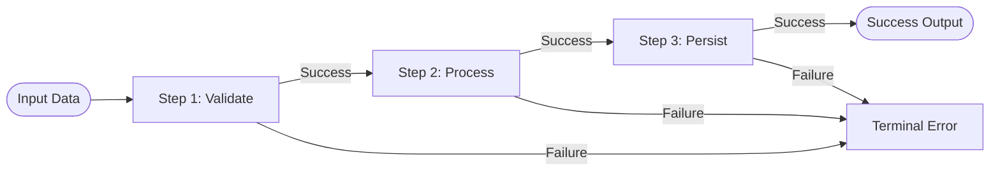

# Level 00 — Architecture & Functional Philosophy

> **Ecosystem:** `EricksonLopez.Result` | **Audience:** Principal Architects, Tech Leads, Senior Engineers | **Language:** English

---

## 1. The Problem: Exceptions as Control Flow

In traditional .NET applications, exceptions are frequently misused for anticipated domain and validation failures:

```csharp
// ANTI-PATTERN: Heavy CPU and GC overhead for expected business flow
public User GetUser(Guid id)
{
    var user = _repository.Find(id);
    if (user is null)
    {
        throw new UserNotFoundException($"User '{id}' was not found.");
    }
    return user;
}
```

### Why Exceptions Harm High-Throughput Distributed Systems:
1. **CPU Overhead**: Unwinding the call stack and capturing the stack trace costs ~4,000–5,000 nanoseconds per throw.
2. **GC Pressure**: Each thrown exception allocates heap objects (`Exception`, `StackTrace`, string buffers).
3. **Hidden Control Flow**: Method signatures (`User GetUser(Guid id)`) lie about their potential failure modes, forcing callers to wrap everything in `try/catch` blocks or risk unhandled 500 errors.

---

## 2. The Solution: Railway-Oriented Programming (ROP)

Railway-Oriented Programming models computations as two parallel tracks:
- **Success Track (Green)**: Carries the computed domain value forward into subsequent operations.
- **Failure Track (Red)**: Bypasses subsequent steps and short-circuits to the terminal result with rich domain error diagnostics.



---

## 3. Zero-Allocation Design Guarantees

`EricksonLopez.Result` was designed from the ground up to achieve **zero heap allocations on the success path**:

```csharp
// Readonly struct value type envelope: fits in CPU registers, 0 bytes GC heap allocation
public readonly struct Result : IResultOutcome
{
    public bool IsSuccess { get; }
    public bool IsFailure { get; }
    public bool IsUninitialized { get; }
    public Error Error { get; }
}

public readonly struct Result<TValue> : IResultOutcome
{
    public bool IsSuccess { get; }
    public bool IsFailure { get; }
    public bool IsUninitialized { get; }
    public TValue Value { get; }
    public Error Error { get; }
}
```

### Key Performance Characteristics:
- **Success Instantiation**: `0.31 ns` (0 bytes allocated).
- **Monadic Binding (3 steps)**: `1.42 ns` (0 bytes allocated with closure-free `TState` overloads).
- **Memory Footprint**: 16–24 bytes on the stack.
- **Native AOT**: 100% Native AOT and trimming compliant (`EnableTrimAnalyzer=true`).

---

## Next Steps
Proceed to [Level 01 — Getting Started & Core Primitives](level-01-getting-started.md) to explore basic result creation, error factories, and value unwrapping.
