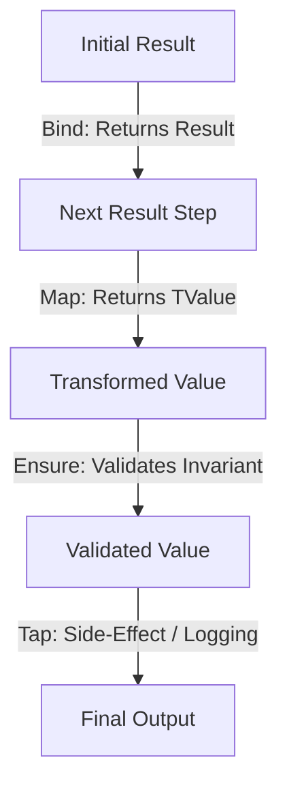

# Level 03 — Railway Pipelines & Monadic Composition

> **Ecosystem:** `EricksonLopez.Result` | **Audience:** Backend Engineers & Systems Architects | **Language:** English

---

## 1. Monadic Combinator Reference

`EricksonLopez.Result` provides a complete suite of functional operators to construct clean, linear business pipelines:



### Quick Operator Reference:
- **`Bind`**: Chains a function that returns a new `Result<TNext>`. Short-circuits immediately on failure.
- **`Map`**: Transforms the inner value using a synchronous or asynchronous projection `TIn -> TOut`.
- **`TapOnSuccess` / `TapOnFailure`**: Executes a side-effect (e.g. telemetry, audit logging) without modifying the pipeline value.
- **`Ensure`**: Asserts a domain invariant predicate; converts the result to a failure if the predicate returns `false`.
- **`MapError`**: Transforms or enriches the `Error` instance if the pipeline is in a failure state.
- **`Recover`**: Intercepts a failure and provides an alternative fallback computation.

---

## 2. Real-World Pipeline Example

```csharp
public async Task<Result<OrderConfirmation>> ProcessCheckoutAsync(
    CheckoutRequest request, 
    CancellationToken cancellationToken)
{
    return await ValidateRequest(request)
        .Ensure(req => req.Items.Count > 0, DomainErrors.Order.EmptyCart, cancellationToken)
        .Bind(req => _inventoryService.ReserveStockAsync(req, cancellationToken), cancellationToken)
        .Bind(reservation => _paymentService.ChargeAsync(reservation, cancellationToken), cancellationToken)
        .TapOnSuccess(payment => _logger.LogInformation("Payment charged: {PaymentId}", payment.Id), cancellationToken)
        .Map(payment => CreateOrderConfirmation(payment), cancellationToken);
}
```

---

## 3. High-Performance Closure-Free `TState` Mechanics

In high-throughput microservices (10,000+ QPS), standard lambdas that capture local variables generate compiler display classes on the heap:

```csharp
// Standard Lambda: Allocates a compiler-generated closure display class on heap
Guid tenantId = GetCurrentTenant();
var result = userResult.Bind(user => _userService.AssignTenant(user, tenantId));
```

### The Zero-Allocation Solution:
Use `TState` overloads with `static` lambdas to pass external variables without closure allocations:

```csharp
// Zero-Allocation Pipeline: No heap allocation!
Guid tenantId = GetCurrentTenant();

var result = userResult.Bind(
    state: (_userService, tenantId),
    selector: static (state, user) => state._userService.AssignTenant(user, state.tenantId));
```

---

## 4. LINQ Query Comprehension Syntax

For developers who prefer declarative query syntax, `EricksonLopez.Result` implements monadic LINQ binding:

```csharp
Result<OrderSummary> summaryResult = 
    from customer in GetCustomer(customerId)
    from cart in GetActiveCart(customer.Id)
    where cart.TotalAmount > 0
    from discount in CalculateDiscount(customer, cart)
    select new OrderSummary(customer.Name, cart.TotalAmount - discount);
```

---

## Next Steps
Proceed to [Level 04 — Compound Validation & Maybe Monad](level-04-compound-validation-and-maybe.md) to explore multi-rule aggregation via `Result.ValidateAll` and optional values via `Maybe<T>`.
