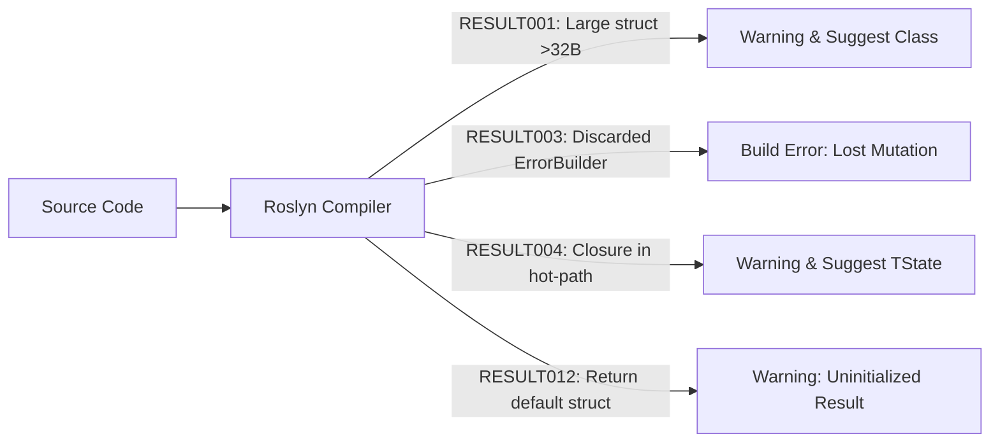

# Level 06 — Integrations: FluentValidation, MediatR & Analyzers

> **Ecosystem:** `EricksonLopez.Result` | **Audience:** Senior Engineers & Tech Leads | **Language:** English

---

## 1. FluentValidation Integration

Install the FluentValidation extension:

```bash
dotnet add package EricksonLopez.Result.FluentValidation
```

### Mapping `ValidationResult` to `Error.Validation`:

```csharp
using EricksonLopez.Result;
using EricksonLopez.Result.FluentValidation;
using FluentValidation;

public class CreateCustomerValidator : AbstractValidator<CreateCustomerCommand>
{
    public CreateCustomerValidator()
    {
        RuleFor(x => x.Email).NotEmpty().EmailAddress();
        RuleFor(x => x.FullName).NotEmpty().MinimumLength(3);
    }
}

// In your application handler:
var validationResult = await validator.ValidateAsync(command, cancellationToken);
if (!validationResult.IsValid)
{
    // Converts FluentValidation failures into an EricksonLopez.Result composite Error!
    return validationResult.ToValidationResult().Error;
}
```

---

## 2. MediatR Pipeline Behavior

Install the MediatR adapter:

```bash
dotnet add package EricksonLopez.Result.MediatR
```

### Automatic Exception Pipeline Behavior:

```csharp
// Program.cs
builder.Services.AddMediatR(cfg =>
{
    cfg.RegisterServicesFromAssemblyContaining<Program>();
    cfg.AddResultExceptionBehavior(); // Automatically catches unhandled exceptions and returns Result.Failure
});
```

When an unhandled exception occurs in a MediatR handler returning `Result` or `Result<T>`, the pipeline intercepts execution and immediately returns a `Result.Failure(error)` wrapping the exception as an unexpected domain failure, preventing process crashes.

---

## 3. Roslyn Diagnostic Analyzers & CodeFixes

The core package `EricksonLopez.Result` bundles 11 Roslyn diagnostic rules (`EricksonLopez.Result.Analyzers`) to catch architectural bugs at compile time:



### Common Diagnostics:
- **`RESULT003` (Discarded `ErrorBuilder` Return)**: Emits a compile-time error when the return value of an `ErrorBuilder` mutation is discarded.
- **`RESULT004` (Closure Allocation)**: Detects captured variables in monadic chains and offers an automated CodeFix to rewrite the lambda with a closure-free `TState` overload.
- **`RESULT012` (Uninitialized `default(Result)`)**: Warns when returning `default(Result)` or `default(Result<T>)`, preventing uninitialized struct bugs.

---

## Next Steps
Proceed to [Level 07 — Native AOT & Zero-Reflection Serialization](level-07-native-aot-and-serialization.md) to learn how to achieve instant startup and minimal memory footprint in containerized environments.
