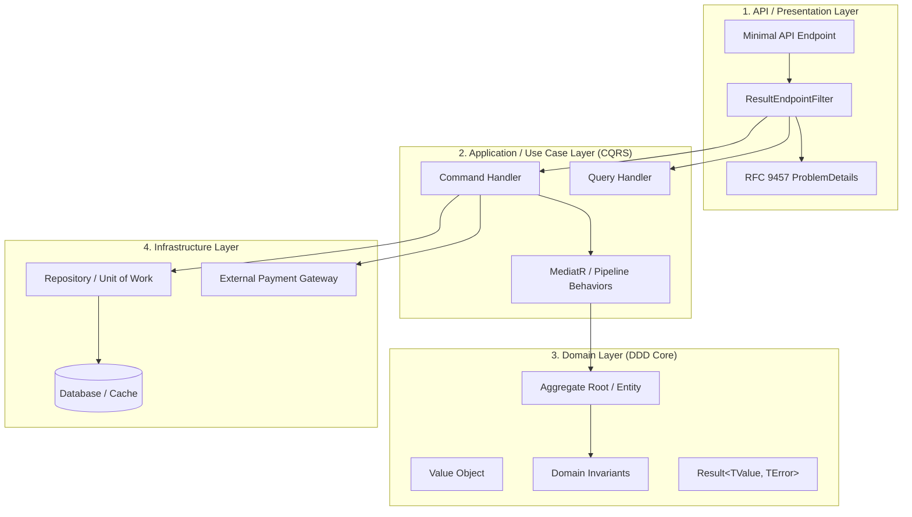

# Level 10 — Enterprise Architecture: Clean Architecture, DDD & CQRS

> **Ecosystem:** `EricksonLopez.Result` | **Audience:** Enterprise Architects, Principal Engineers | **Complexity:** Level 10 (Mastery) | **Scope:** Enterprise-Grade Systems | **Language:** English

---

## 1. Supported Architectural Topologies

`EricksonLopez.Result` was engineered to integrate naturally into Clean Architecture, Hexagonal, and Domain-Driven Design (DDD) enterprise systems:



---

## 2. Domain Layer: Aggregate Roots & Invariants

At the core of the domain model, entity factories and business mutation methods never throw exceptions for anticipated rule violations; they return `Result` or `Result<T>`:

```csharp
public sealed class BankAccount
{
    public Guid Id { get; }
    public decimal Balance { get; private set; }

    public Result Deposit(decimal amount)
    {
        if (amount <= 0)
            return Result.Failure(Error.Validation("Account.InvalidAmount", "Deposit amount must be positive."));

        Balance += amount;
        return Result.Success();
    }

    public Result Withdraw(decimal amount)
    {
        if (amount <= 0)
            return Result.Failure(Error.Validation("Account.InvalidAmount", "Withdrawal amount must be positive."));

        if (Balance < amount)
            return Result.Failure(Error.Conflict("Account.InsufficientFunds", "Insufficient funds for withdrawal."));

        Balance -= amount;
        return Result.Success();
    }
}
```

---

## 3. Application Layer: Use Cases & CQRS

Application services and CQRS handlers orchestrate workflows across domain aggregates, repositories, and external gateways using Railway-Oriented Programming:

```csharp
public sealed class WithdrawFundsCommandHandler : IRequestHandler<WithdrawFundsCommand, Result<TransactionReceipt>>
{
    private readonly IAccountRepository _repository;
    private readonly IUnitOfWork _uow;

    public async Task<Result<TransactionReceipt>> Handle(WithdrawFundsCommand cmd, CancellationToken ct)
    {
        return await _repository.GetByIdAsync(cmd.AccountId, ct)
            .ToResult(Error.NotFound("Account.NotFound", $"Account '{cmd.AccountId}' does not exist."))
            .Ensure(acc => acc.Withdraw(cmd.Amount))
            .Bind(async acc =>
            {
                await _uow.SaveChangesAsync(ct);
                return Result.Success(new TransactionReceipt(acc.Id, cmd.Amount, DateTime.UtcNow));
            });
    }
}
```

---

## 4. Presentation Layer: Minimal APIs & HTTP Boundaries

The presentation layer remains purely declarative. Handlers delegate to application commands and project results into RFC 9457 ProblemDetails:

```csharp
app.MapPost("/accounts/{id}/withdraw", async (Guid id, WithdrawDto dto, ISender sender, CancellationToken ct) =>
{
    Result<TransactionReceipt> result = await sender.Send(new WithdrawFundsCommand(id, dto.Amount), ct);
    return result.ToHttpResult();
})
.AddResultEndpointFilter()
.ProducesResult<TransactionReceipt>(StatusCodes.Status200OK)
.ProducesResultProblemDetails(StatusCodes.Status400BadRequest, StatusCodes.Status404NotFound, StatusCodes.Status409Conflict);
```

---

## 5. Summary of Layer Boundaries

| Layer | Input Boundary | Output Boundary | Error Translation Responsibility |
|---|---|---|---|
| **Infrastructure** | Network / SQL exceptions | `Result.Try` / `Maybe<T>` | Translates driver exceptions into `Error.Unavailable` or `Error.Infrastructure` |
| **Domain** | Business commands | `Result` / `Result<T>` | Enforces business invariants returning `Error.Validation` or `Error.Conflict` |
| **Application** | CQRS Commands / Queries | `Result<TResponse>` | Orchestrates domain transactions and functional pipelines |
| **Presentation** | HTTP Requests | `IResult` (HTTP Status + RFC 9457) | `ToHttpResult()` maps `ErrorType` to standard HTTP status codes |

---

## Conclusion
You have explored all **11 levels of the `EricksonLopez.Result` Progressive Showcase**. Refer to the **[Cookbook](../cookbook.md)** and the **[Package Reference](../package-reference.md)** for specialized production recipes and deep architectural specifications.
