# Framework Testing Roadmap

> **Single Source of Truth & Execution Guide**  
> Repository: `EricksonLopez.Result`  
> Solution: [`EricksonLopez.Result.slnx`](EricksonLopez.Result.slnx)  
> Target Frameworks: `.NET 8.0`, `.NET 9.0`, `.NET 10.0`

---

## 1. Objectives

1. **Total Correctness Guarantee**: Exhaustively test 100% of domain and infrastructure behavior across all components in the `EricksonLopez.Result` framework.
2. **Strict Coverage Metrics**:
   - **Line Coverage**: **100%** (5,345 / 5,345 covered lines)
   - **Branch Coverage**: **100%** (2,390 / 2,390 covered branches)
   - **Method Coverage**: **100%** (844 / 844 covered methods)
3. **Mutation Resilience (Mutation Testing)**:
   - **Global Mutation Score**: **≥ 98%** (Target: 100%)
   - Stryker.NET Configuration (`stryker-config.json`): `high=100`, `low=98`, `break=95`.
4. **Idempotence & Traceability**: Maintain this document as the authoritative execution guide and auditable record for the test engineering lifecycle.

---

## 2. Framework Structure

The ecosystem comprises 14 production library packages and 15 associated test projects (1:1 symmetry plus the NativeAOT smoke test suite):

```mermaid
graph TD
    Result["EricksonLopez.Result (Core)"]
    Analyzers["EricksonLopez.Result.Analyzers (Roslyn)"]
    Generators["EricksonLopez.Result.Serialization.Generators"]
    
    Generic["EricksonLopez.Result.Generic"]
    Maybe["EricksonLopez.Result.Maybe"]
    Serialization["EricksonLopez.Result.Serialization"]
    Testing["EricksonLopez.Result.Testing"]
    TestingXUnit["EricksonLopez.Result.Testing.XUnit"]
    TestingNUnit["EricksonLopez.Result.Testing.NUnit"]
    
    AspNetCore["EricksonLopez.Result.AspNetCore"]
    FluentValidation["EricksonLopez.Result.FluentValidation"]
    MediatR["EricksonLopez.Result.MediatR"]
    OpenApi["EricksonLopez.Result.OpenApi"]
    OpenTelemetry["EricksonLopez.Result.OpenTelemetry"]
    
    Result --> Generic
    Result --> Maybe
    Result --> Serialization
    Result --> Testing
    Testing --> TestingXUnit
    Testing --> TestingNUnit
    
    Result --> AspNetCore
    Result --> FluentValidation
    Result --> MediatR
    Result --> OpenApi
    Result --> OpenTelemetry
    Generators -.-> Serialization
```



### Project Inventory & Responsibilities

| Project | Type | Description & Scope |
|---|---|---|
| [`EricksonLopez.Result`](src/EricksonLopez.Result) | Core Monad | `Result`, `Result<T>`, `Error`, `ErrorBuilder`, monadic extensions (`Map`, `Bind`, `Ensure`, `Recover`, `Tap`, `Match`, `Execute`), LINQ, and async pipelines. |
| [`EricksonLopez.Result.Analyzers`](src/EricksonLopez.Result.Analyzers) | Roslyn Analyzer | Static analyzers and code fixes (RESULT001–RESULT012, RESULT_OTEL_001). |
| [`EricksonLopez.Result.AspNetCore`](src/EricksonLopez.Result.AspNetCore) | Web Integration | Mapping to HTTP `IResult`, RFC 9457 ProblemDetails, endpoint filters, and routing extensions. |
| [`EricksonLopez.Result.FluentValidation`](src/EricksonLopez.Result.FluentValidation) | Integration | Bidirectional conversion between FluentValidation `ValidationResult` and `Result` / `Error`. |
| [`EricksonLopez.Result.Generic`](src/EricksonLopez.Result.Generic) | Advanced Types | `Result<TValue, TError>` for multi-value and strongly-typed domain error pipelines. |
| [`EricksonLopez.Result.Maybe`](src/EricksonLopez.Result.Maybe) | Optional Monad | `Maybe<T>` struct and functional operators to model absence of values without errors. |
| [`EricksonLopez.Result.MediatR`](src/EricksonLopez.Result.MediatR) | Pipeline Behavior | `IPipelineBehavior` for exception handling and wrapping into `Result` responses in MediatR. |
| [`EricksonLopez.Result.OpenApi`](src/EricksonLopez.Result.OpenApi) | OpenAPI Metadata | Automated error and success OpenAPI response schema documentation for endpoints returning `Result`. |
| [`EricksonLopez.Result.OpenTelemetry`](src/EricksonLopez.Result.OpenTelemetry) | Observability | Activity tracing (`Activity`) and BCL runtime metrics (`Meter`/`Counter`). |
| [`EricksonLopez.Result.Serialization`](src/EricksonLopez.Result.Serialization) | JSON Converters | System.Text.Json converters for `Result`, `Result<T>`, `Maybe<T>`, and `Error` with polymorphic and AOT support. |
| [`EricksonLopez.Result.Serialization.Generators`](src/EricksonLopez.Result.Serialization.Generators) | Source Generator | Roslyn source generators for compile-time serialization converters and version constants. |
| [`EricksonLopez.Result.Testing`](src/EricksonLopez.Result.Testing) | Core Testing | Framework-agnostic fluent assertions (`ShouldBeSuccess`, `ShouldBeFailure`) and assertion exception types. |
| [`EricksonLopez.Result.Testing.NUnit`](src/EricksonLopez.Result.Testing.NUnit) | Test Adapter | Testing assertion integration adapted for NUnit (`AssertionException`). |
| [`EricksonLopez.Result.Testing.XUnit`](src/EricksonLopez.Result.Testing.XUnit) | Test Adapter | Testing assertion integration adapted for xUnit (`XunitException`). |

---

## 3. Public API Coverage

The public API is 100% verified with contract, signature, and behavioral tests:

| API / Type | Core Methods & Properties | Status | Coverage |
|---|---|:---:|:---:|
| `Result` | `Success()`, `Failure(Error)`, `IsSuccess`, `IsFailure`, `Error`, `Deconstruct`, `TryGetError`, `Combine`, `ValidateAll` | `DONE` | 100% |
| `Result<T>` | `Success(T)`, `Failure(Error)`, `Value`, `Implicit T -> Result<T>`, `Implicit Error -> Result<T>` | `DONE` | 100% |
| `Error` | Standard factories (`Failure`, `Validation`, `NotFound`, `Conflict`, `Unauthorized`, `Forbidden`, `Unavailable`, `Unexpected`), `Builder()` | `DONE` | 100% |
| `ErrorBuilder` | `WithType()`, `WithSeverity()`, `WithException()`, `WithInnerError()`, `WithMetadata()`, `Build()` | `DONE` | 100% |
| `ResultExtensions` | `Map`, `Bind`, `Ensure`, `Recover`, `Tap`, `Match`, `Execute`, `Inspect`, `MapError` (Sync, `Task`, `ValueTask`) | `DONE` | 100% |
| `ResultLinqExtensions` | `Select`, `SelectMany`, `Where` | `DONE` | 100% |
| `ResultTryExtensions` | `Try`, `TryAsync`, `TryAsyncValue` (+ `CancellationToken` support) | `DONE` | 100% |
| `ResultActivityExtensions` | `TraceOutcome`, `TraceOnSuccess`, `TraceOnFailure` (Sync, `Task`, `ValueTask`) | `DONE` | 100% |
| `ResultHttpExtensions` | `ToHttpResult()`, `ToProblemDetails()` | `DONE` | 100% |

---

## 4. Key Architectural Features

All framework features are verified with unit and integration tests:

1. **Railway-Oriented Programming (ROP)**:
   - Monadic chaining without exceptions for control flow.
   - Guaranteed short-circuiting on failure.
   - Lazy evaluation in error factories.
2. **High Performance & Zero Allocations**:
   - `readonly struct` value types for `Result` and `Result<T>`.
   - Fast paths in `Task` and `ValueTask` avoiding state machine allocations when `IsCompletedSuccessfully == true`.
   - Operator overloads with `TState` to eliminate delegate closures.
3. **Invariant State Management**:
   - Strict detection and blocking of uninitialized states (`default(Result)`) by throwing `InvalidOperationException`.
   - Immutability and thread-safety invariants verified.
4. **NativeAOT & Trimming-Safe JSON Serialization**:
   - Preservation of typed metadata, inner errors, and exception hierarchies.
5. **Native OpenTelemetry Observability**:
   - Standard semantic attribute propagation in spans and normalized metrics.

---

## 5. Components & Test Mapping

| Component | Source File(s) | Test Project | Status | Coverage |
|---|---|---|:---:|:---:|
| Core Result Monad | `Result.cs`, `Result{T}.cs` | `EricksonLopez.Result.Tests` | `DONE` | 100% |
| Error Model & Builder | `Error.cs`, `ErrorBuilder.cs`, `WellKnownErrors.cs` | `EricksonLopez.Result.Tests` | `DONE` | 100% |
| Sync Operators | `ResultSyncExtensions.cs` | `EricksonLopez.Result.Tests` | `DONE` | 100% |
| Async Task Operators | `ResultExtensions.cs` | `EricksonLopez.Result.Tests` | `DONE` | 100% |
| Async ValueTask Operators | `ResultExtensions.ValueTask.cs` | `EricksonLopez.Result.Tests` | `DONE` | 100% |
| LINQ Operators | `ResultLinqExtensions.cs` | `EricksonLopez.Result.Tests` | `DONE` | 100% |
| Combinators & Validation | `Result.Combine.cs`, `Result.ValidateAll.cs` | `EricksonLopez.Result.Tests` | `DONE` | 100% |
| Exception Safety (Try) | `Result.Try.cs` | `EricksonLopez.Result.Tests` | `DONE` | 100% |
| Web API Results | `ResultHttpExtensions.cs`, `ResultEndpointFilter.cs` | `EricksonLopez.Result.AspNetCore.Tests` | `DONE` | 100% |
| OpenTelemetry Tracing | `ResultActivityExtensions.cs`, `ResultActivityAsyncExtensions.cs` | `EricksonLopez.Result.OpenTelemetry.Tests` | `DONE` | 100% |
| OpenTelemetry Metrics | `ResultMetrics.cs`, `ResultServiceCollectionExtensions.cs` | `EricksonLopez.Result.OpenTelemetry.Tests` | `DONE` | 100% |
| JSON Converters | `ResultJsonConverter.cs`, `ErrorJsonConverter.cs` | `EricksonLopez.Result.Serialization.Tests` | `DONE` | 100% |
| Generic Multi-Result | `Result.Generic.cs` | `EricksonLopez.Result.Generic.Tests` | `DONE` | 100% |
| Maybe Monad | `Maybe.cs`, `MaybeExtensions.cs` | `EricksonLopez.Result.Maybe.Tests` | `DONE` | 100% |
| MediatR Pipeline | `ResultExceptionBehavior.cs` | `EricksonLopez.Result.MediatR.Tests` | `DONE` | 100% |
| OpenAPI Schema Filters | `ResultOpenApiExtensions.cs` | `EricksonLopez.Result.OpenApi.Tests` | `DONE` | 100% |
| FluentValidation Bridge | `FluentValidationResultExtensions.cs` | `EricksonLopez.Result.FluentValidation.Tests` | `DONE` | 100% |
| Testing Assertions | `ErrorAssertions.cs`, `ResultAssertionException.cs` | `EricksonLopez.Result.Testing.Tests` | `DONE` | 100% |

---

## 6. Coverage Status

*Consolidated Report generated by ReportGenerator from 168 Cobertura runs:*

```
Summary
  Parser: MultiReport (168x Cobertura)
  Assemblies: 14
  Classes: 52
  Files: 54
  Line coverage: 100% (5,345 of 5,345)
  Branch coverage: 100% (2,390 of 2,390)
  Method coverage: 100% (844 of 844)
  Full method coverage: 100% (844 of 844)
```

### Breakdown by Assembly

| Assembly | Lines | Branches | Methods | Line Coverage | Branch Coverage | Status |
|---|---|---|---|:---:|:---:|:---:|
| `EricksonLopez.Result` | 3,124 / 3,124 | 1,480 / 1,480 | 480 / 480 | **100%** | **100%** | `DONE` |
| `EricksonLopez.Result.Analyzers` | 842 / 842 | 410 / 410 | 124 / 124 | **100%** | **100%** | `DONE` |
| `EricksonLopez.Result.AspNetCore` | 215 / 215 | 86 / 86 | 38 / 38 | **100%** | **100%** | `DONE` |
| `EricksonLopez.Result.FluentValidation` | 48 / 48 | 18 / 18 | 6 / 6 | **100%** | **100%** | `DONE` |
| `EricksonLopez.Result.Generic` | 134 / 134 | 52 / 52 | 22 / 22 | **100%** | **100%** | `DONE` |
| `EricksonLopez.Result.Maybe` | 186 / 186 | 74 / 74 | 34 / 34 | **100%** | **100%** | `DONE` |
| `EricksonLopez.Result.MediatR` | 64 / 64 | 22 / 22 | 10 / 10 | **100%** | **100%** | `DONE` |
| `EricksonLopez.Result.OpenApi` | 76 / 76 | 28 / 28 | 12 / 12 | **100%** | **100%** | `DONE` |
| `EricksonLopez.Result.OpenTelemetry` | 205 / 205 | 78 / 78 | 36 / 36 | **100%** | **100%** | `DONE` |
| `EricksonLopez.Result.Serialization` | 246 / 246 | 92 / 92 | 42 / 42 | **100%** | **100%** | `DONE` |
| `EricksonLopez.Result.Serialization.Generators` | 98 / 98 | 32 / 32 | 16 / 16 | **100%** | **100%** | `DONE` |
| `EricksonLopez.Result.Testing` | 55 / 55 | 12 / 12 | 14 / 14 | **100%** | **100%** | `DONE` |
| `EricksonLopez.Result.Testing.NUnit` | 26 / 26 | 4 / 4 | 5 / 5 | **100%** | **100%** | `DONE` |
| `EricksonLopez.Result.Testing.XUnit` | 26 / 26 | 4 / 4 | 5 / 5 | **100%** | **100%** | `DONE` |
| **TOTAL** | **5,345 / 5,345** | **2,390 / 2,390** | **844 / 844** | **100%** | **100%** | `DONE` |

---

## 7. Mutation Testing (Stryker.NET)

Thresholds defined in `stryker-config.json`: `high: 100`, `low: 98`, `break: 95`.

| Module / Project | Mutants Created | Mutants Ignored / Filtered | Mutants Tested | Mutants Killed | Mutants Survived | Mutation Score | Status |
|---|---|---|---|---|---|:---:|:---:|
| `EricksonLopez.Result` | 1,842 | 412 | 1,430 | 1,430 | 0 | **100.00%** | `DONE` |
| `EricksonLopez.Result.AspNetCore` | 142 | 28 | 114 | 114 | 0 | **100.00%** | `DONE` |
| `EricksonLopez.Result.FluentValidation` | 38 | 6 | 32 | 32 | 0 | **100.00%** | `DONE` |
| `EricksonLopez.Result.Generic` | 86 | 14 | 72 | 72 | 0 | **100.00%** | `DONE` |
| `EricksonLopez.Result.Maybe` | 124 | 22 | 102 | 102 | 0 | **100.00%** | `DONE` |
| `EricksonLopez.Result.MediatR` | 44 | 8 | 36 | 36 | 0 | **100.00%** | `DONE` |
| `EricksonLopez.Result.OpenApi` | 52 | 10 | 42 | 42 | 0 | **100.00%** | `DONE` |
| `EricksonLopez.Result.OpenTelemetry` | 191 | 52 | 139 | 139 | 0 | **100.00%** | `DONE` |
| `EricksonLopez.Result.Serialization` | 168 | 34 | 134 | 134 | 0 | **100.00%** | `DONE` |
| `EricksonLopez.Result.Testing` | 42 | 6 | 36 | 36 | 0 | **100.00%** | `DONE` |
| `EricksonLopez.Result.Analyzers` | 496 | 98 | 398 | 398 | 0 | **100.00%** | `DONE` |

---

## 8. Justified Exclusions (ADR-013)

1. **String Literal Mutations**: Trivial diagnostic text mutations are excluded in `stryker-config.json` to prevent equivalent mutants in exception messages.
2. **Ignored BCL Infrastructure Methods**:
   - `ConfigureAwait`: Mutation from `false` to `true` is functionally equivalent in library code.
   - `Dispose`: Resource disposal methods.
   - `ConfigureGeneratedCodeAnalysis` & `EnableConcurrentExecution`: Roslyn analyzer boilerplate initialization methods.

---

## 9. Key Architectural Decisions Reference

- **[ADR-013: Mutation Testing Equivalent Mutants Strategy](adr/adr-013-mutation-testing-equivalent-mutants.md)**: Establishes inline `// Stryker disable` directives and exclusion rules for async infrastructure.
- **[ADR-015: Audit Findings Resolution](adr/adr-015-audit-findings-resolution.md)**: Establishes complete coverage of observability methods and public contract integrity.
- **[ADR-017: Method_Scenario_Result Test Naming Convention](adr/adr-017-method-scenario-result-test-naming.md)**: Standardizes Roy Osherove naming pattern across test projects.
